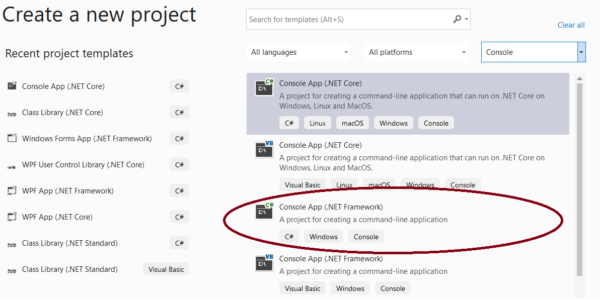

# {{ title }}

It is traditional to begin by writing a simple program that displays a string to the screen. We’ll use this exercise to explore some fundamental aspects of C# programming and get acquainted with using an Integrated Development Environment (IDE) like Visual Studio to create, save, compile, and run a basic program.

## Getting Started with Visual Studio

Visual Studio is a professional-grade IDE, which stands for __Integrated Development Environment__. An IDE provides a suite of tools for building applications, including a text editor, compiler, and debugger. Although Visual Studio may seem overwhelming at first, don't be discouraged. With practice, it will become a powerful tool that simplifies your coding experience.

You can download Visual Studio from [visualstudio.com/downloads](https://www.visualstudio.com/downloads). Choose the Community edition, which is free and available for both Windows and Mac. If you’re using Linux, download [Visual Studio Code](https://code.visualstudio.com/), along with the latest version of .NET. Visual Studio Code, together with the OmniSharp extension, will work fine for all the examples and exercises in this tutorial.

## Creating Your First C# Console Application

1. **Start Visual Studio Community** and go to `File -> New -> Project`. Select “Create New Project”.

    <figure markdown="span">
      {width="600"}
      <figcaption>Create New Project in Visual Studio 2019</figcaption>
    </figure>

2. In the next window, search for the **Console App** template:

    <figure markdown="span">
      {width="600"}
      <figcaption>Select Console application template</figcaption>
    </figure>

3. Configure the project by specifying the name and location where it will be stored:

    <figure markdown="span">
      {width="600"}
      <figcaption>Configure the console application</figcaption>
    </figure>

4. Click **Create**. The new project is now set up and includes a C# source code file named `Program.cs`.

### Understanding the Default Program Structure

By default, the `Program.cs` file contains the following code:

```cs
using System;
using System.Collections.Generic;
using System.Linq;
using System.Text;
using System.Threading.Tasks;

namespace HelloWorld
{
    class Program
    {
        static void Main(string[] args)
        {
            // YOUR CODE GOES HERE
        }
    }
}
```

!!! note
    The lines at the top of the file will be greyed out, except for `using System;`. You can safely delete the others as they are not needed for this simple program.

Replace the comment `// YOUR CODE GOES HERE` with the following code:

```cs
Console.WriteLine("Hello, World!");
Console.ReadKey();
```

### Breaking Down the Code

There are five key components in this simple program:

1. **Using Statements**: These statements import namespaces that contain classes and methods for use in your program. For this basic example, only the `System` namespace is needed.

2. **Namespace**: This is a way to organize code and avoid naming conflicts. The default namespace in this program matches the project name you chose earlier.

3. **Class**: C# is an object-oriented language, and all code must be contained within a class. Here, `Program` is the name of our class.

4. **Main Method**: This is the entry point of the program. Every C# console application must have a `Main` method. The `static` keyword indicates that it is a class method, and `void` means it does not return any value. The `args` parameter can hold command-line arguments, though we won’t be using it in this example.

5. **Code Block**: This is where your program logic goes, between the curly braces `{ ... }`.

Our program is just two lines long:

- `Console.WriteLine("Hello, World!");` - This line prints the text "Hello, World!" to the console.
- `Console.ReadKey();` - This line waits for the user to press any key before closing the console window.

### Running the Program

Click the _Start_ button in the toolbar (the green arrow) or press `F5`. If everything is correct, a console window will appear displaying the message "Hello, World!". Press any key to exit.

If you see a red underline under `Console`, it means the `System` namespace is missing. Add `using System;` at the top of your file to resolve this.

## Task: Enhancing the Hello World Application

__Enhance your application to prompt the user for their name and display it along with the date and time.__

To do this, replace the code inside the `Main` method with the following:

```cs
Console.WriteLine("\nWhat is your name?");
var name = Console.ReadLine();
Console.WriteLine("Hello, " + name);
Console.WriteLine("Press any key to exit...");
Console.ReadKey();
```

!!! note "Can you predict what the program will now do?"
    This code will prompt the user to enter their name, store it in a variable called `name`, and then greet the user with their name. It will also display a message explaining how to exit the program.

### Explanation of the New Code

- The `\n` is an escape sequence that moves the cursor to the next line.
- `var name` declares a variable. The type of `name` will be determined at runtime, based on what the user enters.
- The `+` operator concatenates (joins) two strings together.

Run the modified program to ensure it behaves as expected. If you copied and pasted the code, check for any incorrect quote marks, which may cause errors.

Congratulations, you've created and run your first C# application!

!!! note "From the syllabus"
    Understand and know how to declare and use a variable (3.1.1.2/4.1.1.2).

    - A **variable** is a named area of memory. Each variable in C# is given a specific type, which determines the size and layout of the assigned memory, as well as the range of values that can be stored.
