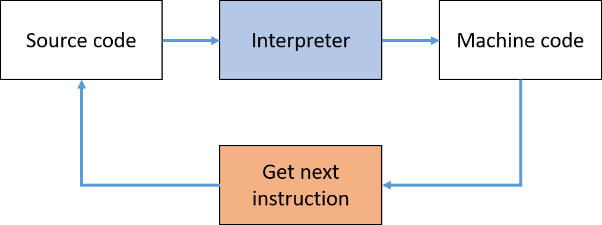

# {{ title }}

In this section, we'll delve into the distinction between high-level and low-level languages, and explore how they relate to computer architecture and programming.

!!! note "From the syllabus"
    Familiarize yourself with the concepts of high-level and low-level languages, and understand how code translation is performed by compilers and interpreters. Explore disassembly to see the machine's perspective on your code.


## High-Level vs. Low-Level Languages

The chapter began with a comparison between high-level languages, which are designed for human readability, and low-level languages, which are closer to the hardware level and more challenging for humans to understand.

### High-Level Languages
High-level languages are designed to be easy for humans to read and write. These languages abstract away the complex details of the computer's hardware, allowing programmers to focus on solving problems without needing to know the intricacies of the underlying architecture. Examples include C#, Python, and Java.

### Low-Level Languages
Low-level languages, on the other hand, are closely tied to the specific hardware of a target machine. They include:

- **Machine Code**: The actual binary instructions executed by the processor.
- **Assembly Language**: A more human-readable version of machine code that still requires an assembler to convert it into machine code.

These languages are rarely used except in scenarios where direct hardware control is needed, such as for systems programming, or when performance and memory efficiency are critical.

### Key Differences

| High-Level Language                          | Low-Level Language                       |
| -------------------------------------------- | ---------------------------------------- |
| **Programmer Friendly**: Easier to read and write | **Machine Friendly**: Difficult for humans, easier for machines |
| **Portable**: Can run on different types of hardware with minimal changes | **Non-Portable**: Tied to specific hardware |
| **Requires Compiler/Interpreter**: Needs to be translated into machine code | **Requires Assembler**: Needs to be translated into machine code |
| **Memory Use**: Less efficient | **Memory Use**: More efficient |
| **Execution Speed**: Typically slower due to abstraction | **Execution Speed**: Faster due to closer hardware interaction |

## Translating High-Level Code

High-level languages must be translated into machine code for the processor to execute them. This is done using either a **compiler** or an **interpreter**:

### Compilers
A compiler translates the entire source code into an executable machine code file. This file can then be run on the target machine without the need for the original source code.

- **Advantages**:
    - Faster execution time after compilation.
    - Source code remains private once compiled.
    - Errors are caught during the compilation phase.

- **Disadvantages**:
    - Takes longer to compile large programs.
    - Platform-specific: A compiled program may need recompilation for different systems.

<figure markdown="span">
  {width="600"}
  <figcaption>Overview of Compiler Process</figcaption>
</figure>

### Interpreters
An interpreter directly executes the source code line by line, without generating an intermediate machine code file.

- **Advantages**:
    - Easier debugging, as errors are caught as the code runs.
    - Platform-independent: Source code can be run on any system with the appropriate interpreter.

- **Disadvantages**:
    - Slower execution due to line-by-line interpretation.
    - Source code needs to be available for execution.

<figure markdown="span">
  {width="600"}
  <figcaption>Overview of Interpreter Process</figcaption>
</figure>

### Key Differences

| Compiler                                     | Interpreter                              |
| -------------------------------------------- | ---------------------------------------- |
| Translates entire source code at once        | Executes source code line by line        |
| Catches syntax errors before execution       | Errors are caught during execution       |
| Generates an independent executable file     | No standalone file; requires source code |
| Faster execution after compilation           | Slower due to real-time interpretation   |
| Source code remains private                  | Source code must be available           |

## Disassembling High-Level Code

To further illustrate the differences, let's examine how high-level C# code is converted into low-level assembly code using Visual Studio's disassembler. Here’s a simple C# program that sums two numbers and prints the result:

```cs
static void Main(string[] args)
{
    int a = 3;
    int b = 4;
    int sum = a + b;

    Console.WriteLine(sum);
    Console.ReadKey();
}
```

### Viewing the Assembly Code

To view the low-level version of this code:

1. Set a **breakpoint** in Visual Studio by clicking in the grey gutter next to a line of code.
2. Run the program in **Debug** mode. It will pause at the breakpoint.
3. From the **Debug > Windows** menu, select **Disassembly**.

You’ll see the disassembled code, which looks like this:

```asm
static void Main(string[] args)
{
    // more code here
02750881  nop  
    int a = 3;
02750882  mov         dword ptr [ebp-40h],3  
    int b = 4;
02750889  mov         dword ptr [ebp-44h],4  
    int sum = a + b;
02750890  mov         eax,dword ptr [ebp-40h]  
02750893  add         eax,dword ptr [ebp-44h]  
02750896  mov         dword ptr [ebp-48h],eax  

    Console.WriteLine(sum);
02750899  mov         ecx,dword ptr [ebp-48h]  
0275089C  call        System.Console.WriteLine(Int32) (6C191938h)  
027508A1  nop  
    Console.ReadKey();
027508A2  lea         ecx,[ebp-54h]  
027508A5  call        System.Console.ReadKey() (6C190EE0h)  
027508AA  nop  
}
```

### Understanding the Assembly Code

- **`mov` Instruction**: Moves a value into a memory location. For example, the line `02750882  mov dword ptr [ebp-40h],3` stores the value `3` in a specific memory location.
- **Registers**: `eax`, `ecx`, etc., are registers in the CPU, used for quick access to data.
- **Memory Addresses**: `ebp-40h` is a memory address, and the `dword` keyword indicates that 32 bits (4 bytes) are being moved.
- **`call` Instruction**: Calls a method or function. Here, it calls `Console.WriteLine()` and `Console.ReadKey()`.

### Insights from Assembly Code

- High-level statements are broken down into multiple low-level instructions.
- Writing and understanding assembly code is more complex and hardware-specific.
- Assembly code operations are not English-like and require an understanding of the CPU’s architecture.

### Viewing the Machine Code

The instructions can also be displayed in machine code (binary) format. Right-click in the disassembly window and select **Show Code Bytes**. For example, the instruction to store `3` in memory:

```asm
01420882 C7 45 C0 03 00 00 00 mov dword ptr [ebp-40h],3
```

- The `03` is the value being moved.
- The remaining bytes correspond to the instruction and the memory address.

### Conclusion

This example demonstrates the complexity of low-level code compared to high-level code. Understanding the underlying machine operations is essential for tasks that require optimization or direct hardware interaction. However, for most programming tasks, high-level languages provide a more efficient and accessible approach.
