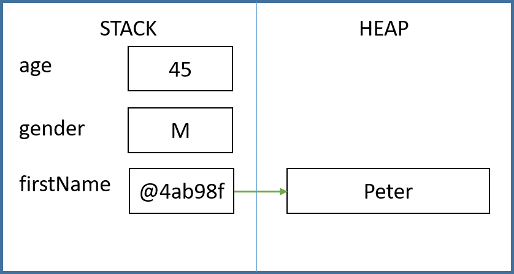
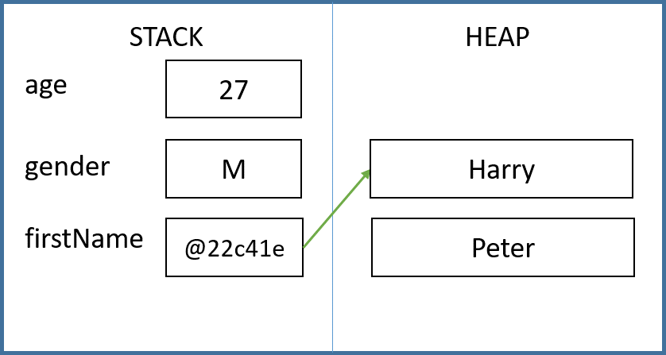

# {{ title }}

C# requires variables to be declared before they can be used, and they must be declared with a specific data type. This ensures that the correct amount of memory is allocated to store the expected data, especially for primitive (value) types.

Data used in programs is given a **name**, or more formally, an **identifier**. It’s good practice to choose a meaningful name that helps anyone reading the code, including yourself, understand what the data represents. For example, `firstName` is a more informative identifier than `fn` for a variable that stores someone's first name.

During the course of a program, the value of a data item may change, which is why it's called a __variable__. In contrast, a __constant__ represents a value that remains the same throughout the program’s execution. Both variables and constants have a name, a defined data type, and a value.

A __constant__ is a data item with a fixed value, set by the programmer, which never changes while the program is running. For example:

```cs
const double PI = 3.14159;
```

Using constants is beneficial when a value is used multiple times in a program. This avoids having to type out the value each time, reducing the risk of errors and inconsistencies. Defining it once at the beginning of the code also makes it easier to update if needed.

## What is a Variable?

A __variable__ is a named storage location in memory where data can be stored. 

!!! note "From the syllabus"
    Be able to explain the differences between a variable and a constant; Be able to explain the advantages of using named constants (3.1.1.6/4.1.1.6).
    
    - A variable’s value can change during the execution of a program, whereas a constant’s value remains fixed. Constants make code easier to read, help avoid using "magic numbers", and allow for easier updates, reducing errors.

All programs use named variables. A __variable__ is associated with a location in memory, and its actual storage location is managed by the operating system. As programmers, we interact with the variable using its name to get or set its value.

Understanding the concept of a variable is fundamental. We need to know how to create, __assign__ a value to, modify, use, and eventually remove variables. At any point, the current values of all variables in a program make up the __program state__, which changes with each step of the program.

All variables have:

- A __Name__: e.g., `age`, `isStudent`.
- A __Type__: e.g., `int` (integer), `bool` (boolean).
- A __Value__: e.g., 25, true.

Unlike some other programming languages, like Python, C# requires a variable to be defined with a name and data type before it can be used.

When naming a variable, use a name that clearly describes the data it holds, so it’s easy to understand when reading the code. There are guidelines and rules for naming variables, but for now, remember that variable names cannot start with a digit, and they cannot be a __keyword__ reserved by the language.

!!! note "From the syllabus"
    AQA: Use meaningful identifier names and know why it is important to use them. (3.1.1.2/4.1.1.2).

Consistent naming is important. There are two main naming conventions: __Pascal Case__ (e.g., `FirstName`, `DateOfBirth`) and __camelCase__ (e.g., `firstName`, `dateOfBirth`). Typically, local variables use camelCase. This is summarized in the table below:

| Identifier Type               | Naming Convention | Example           |
| ----------------------------- | ----------------- | ----------------- |
| Local variables, parameters   | camelCase         | `firstName`, `age`|
| Methods, properties, classes  | Pascal Case       | `PackOfCards`, `Person`|

## Declaring and Using Variables

To declare a new variable in your code, you need to:

- Specify a __type__: e.g., `int`.
- Provide a __name__: e.g., `age`.
- Optionally, provide an initial __value__: e.g., `19` (this is called __initialization__).

Variables are assigned values using the `=` operator:

```cs
string firstName;
int age;

firstName = "Peter";
age = 17;
```

In this code, we declare two variables: `firstName` (a `string`) and `age` (an `int`). Their purpose is clear from their names. Then we __assign__ the value "Peter" to the first and 17 to the second. Note that the `=` operator should be read as "is assigned to," so it means "the value 'Peter' is assigned to the variable `firstName`," rather than "firstName equals Peter" (which wouldn’t make sense mathematically).

## Local vs Global Variables

Variables can be __local__ or __global__. Local variables can only be used in the block of code where they are declared, such as a method (we’ll cover methods in Chapter 9). This is known as __variable scope__. In contrast, global variables can be used anywhere in the program.

## Value and Reference Types

Data types in C# can be categorized as either `value` types or `reference` types. This may seem challenging initially, but it’s important to understand the distinction, and we’ll revisit this concept throughout the course.

__Value Types__ store their actual values in the program’s stack memory and exist while they are in __scope__. For example, a variable declared in `main()` is stored in the stack, an area of memory allocated for the program, until the program ends. Primitive data types such as `int`, `float`, and `bool` are value types.

__Reference Types__ store a _reference_ or _address_ in the stack, pointing to memory allocated on the __heap__. The heap is an area of memory managed by the operating system, dynamically allocated as needed by the program.

This distinction makes sense: when an `int` is declared, the system allocates a fixed 32 bits of memory to store that data. However, when a `string` is declared, the system doesn’t know its length in advance, so memory is allocated dynamically from the heap.

Note: Some languages have an explicit __pointer__ type, which points to a location in memory. While pointers can be used in C#, they are considered unsafe, so we’ll avoid them. Strictly speaking, a _reference_ in C# is not a pointer but a _constant pointer_. This distinction is complex, so remember that a reference type does not store its value directly; it stores the address where the value is stored.

To illustrate, consider the following:

```cs
int age = 45;
char gender = 'M';
string firstName = "Peter";
```

<figure markdown="span">
  {width="600"}
  <figcaption>Value and Reference Types</figcaption>
</figure>

If the following changes are made to our variables:

```cs
age = 27;
gender = 'M';
firstName = "Harry";
```

The memory map now looks like:

<figure markdown="span">
  {width="600"}
  <figcaption>Value and Reference Types</figcaption>
</figure>

Changing a value type modifies its value directly in the stack, but changing a reference type (such as a string) creates a new section of memory for the new value, and the address (reference) is updated. 

The previously allocated block of memory will be cleaned up by the __garbage collector__.

If a reference type variable has not been allocated memory on the heap, it is assigned a value of __null__, indicating that the reference type object has no value.

!!! note "From the syllabus"
    Variables declared as a pointer or reference data type are used as stores for memory addresses of objects created at runtime, i.e., dynamically.

## The `var` Keyword

Although variables should generally be declared with a data type, C# allows the data type to be determined automatically at runtime if the `var` keyword is used:

```cs
var firstName = "Harry";
var age = 17;
```

In this example, the compiler infers the type of `firstName` as `string` because it is initialized with a string value, and the type of `age` as `int` because it is initialized with an integer.

When using `var`, the variable __must__ be initialized with a value.