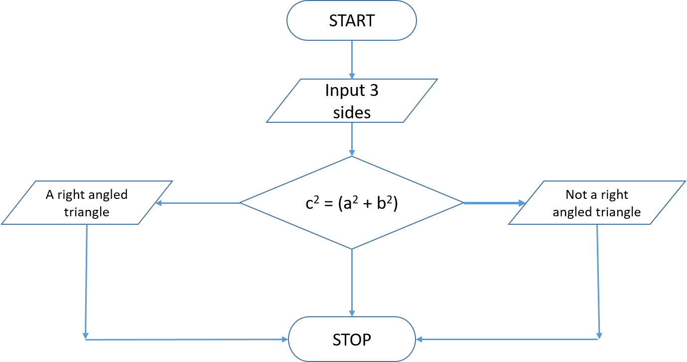

# {{ title }}

!!! note "From the syllabus"
    AQA: Use, understand, and know how the following statement types can be combined in programs; Use nested selection structures (3.1.1.2/4.1.1.2).

Selection is a programming construct where a section of code is executed only if a specified condition is met. The outcome of the condition determines the next path the program will take.

## Basic Conditional Statement

The format of the `if` statement is:

```cs
if (conditional expression)
{
    // body if true
}
```

The conditional expression must evaluate to either `True` or `False`. The body of the statement must be enclosed in curly braces `{ ... }`. Although these braces can be omitted if there is only one statement, it is recommended to include them for improved readability.

## Example 1: Payroll.cs

Let’s review the following code example, where the highlighted lines are discussed beneath the code:

```cs hl_lines="9 18 21"
using System;

namespace payroll
{
    class Program
    {
        static void Main(string[] args)
        {
            const double PAY_RATE = 5.45;
            const int BASIC = 40;
            int hours, overtime;
            double pay;

            Console.Write("Enter number of hours worked: ");
            hours = Convert.ToInt32(Console.ReadLine());

            // calculate basic pay 
            pay = hours * PAY_RATE;

            // calculate overtime and add to basic pay 
            if (hours > BASIC)
            {
                overtime = hours - BASIC;
                pay = pay + (overtime * PAY_RATE);
            }
            // display total pay 
            Console.WriteLine($"Total pay due is £{pay.ToString("N2")}");
            Console.Write("Press any key to quit ...");
            Console.ReadKey();  
        }
    }
}
```

- **Line 9**: Two constants are declared for the hourly pay rate and the number of hours in a standard workweek, followed by two variables for calculating the employee's weekly wage.
- **Line 18**: After obtaining the number of hours worked from the user, the base pay is calculated.
- **Line 21**: If the employee works more than 40 hours, the `BASIC` rate triggers overtime calculation and adds it to the total pay. If this condition is `false`, no overtime is included.

!!! note "Curly Braces"
    Note the use of curly braces, as the `if` contains a **compound statement**. While single statements following `if()` can omit the braces, it is advisable to keep them for clarity and to prevent unforeseen errors. Omitting them may save typing but can lead to confusion.

### Avoiding Magic Numbers

Constants are used for both the pay rate and the threshold number of hours (before overtime applies) to avoid using **magic numbers**—values with no meaningful context. Consider this alternative:

```cs
if (hours > 40)
{
    ...
}
```

What does the number `40` signify? If this value changes, you would need to locate and modify every instance, risking the chance of missing one. Always prefer named constants for clarity.

## Example 2: Triangle.cs

In this example, we introduce an `else` clause to create a 2-way decision construct, allowing for two separate execution paths based on the condition’s truth value.

The format of the `if` statement with an `else` is:

```cs
if (conditional expression)
{
    // body if true
}
else 
{
    // body if false
}
```

This program reads three integers representing the sides of a triangle and checks if it forms a right-angled triangle using Pythagoras' Theorem.

```cs
using System;

namespace triangle
{
    class Program
    {
        static void Main(string[] args)
        {
            Console.Clear();
            // get three sides of the triangle 
            Console.Write("Enter shortest side   > ");
            int sideA = Convert.ToInt32(Console.ReadLine());

            Console.Write("Enter mid-length side > ");
            int sideB = Convert.ToInt32(Console.ReadLine());

            Console.Write("Enter longest side    > ");
            int sideC = Convert.ToInt32(Console.ReadLine());

            // Test for right-angled triangle and output result 
            if ((sideC * sideC) == ((sideA * sideA) + (sideB * sideB)))
            {
                Console.WriteLine("A right-angled triangle");
            }
            else
            {
                Console.WriteLine("Not a right-angled triangle");
            }
            Console.Write("Press any key to exit ...");
            Console.ReadKey();
        }
    }
}
```

The `else` clause executes if the condition evaluates to `false`, establishing two possible execution paths.

We can visualize this algorithm with a flowchart:

<figure markdown="span">
  {width="600"}
  <figcaption>Flow chart example</figcaption>
</figure>

The **flowchart** serves as a useful graphical representation of an algorithm, helping to sketch out the problem and describe the final algorithm in documentation. 

- **Terminators** are represented by ellipses/ovals.
- **Input/Output** by parallelograms.
- **Decisions** by diamonds.
- **Processing** by rectangles.
- **Flow** indicated by arrows.

## Example 3: Grades.cs

To pass an exam, a student must achieve a minimum of 40% on both a project and a written paper. A student who meets this requirement will receive a Pass if the average mark is over 50, a Merit if it is 50 or more but less than 65, and a Distinction for 65 and above. All marks are whole numbers, and the average is rounded up.

```cs
using System;

namespace grades
{
    class Program
    {
        static void Main(string[] args)
        {
            const int PASS = 40;
            const int MERIT = 50;
            const int DISTINCTION = 65;

            int project, exam, average;
            Console.Clear();
            // get marks 
            Console.Write("Enter project mark:   ");
            project = Convert.ToInt32(Console.ReadLine());

            Console.Write("Enter exam mark:    ");
            exam = Convert.ToInt32(Console.ReadLine());

            // calculate the rounded average 
            average = (project + exam + 1) / 2;
            Console.WriteLine("Overall average is " + average.ToString());

            // determine grade 
            if ((project < PASS) || (exam < PASS))
            {
                Console.Write("Student has failed");
            }
            else if (average < MERIT)
            {
                Console.Write("Student has gained a pass");
            }
            else if (average < DISTINCTION)
            {
                Console.Write("Student has gained a merit");
            }
            else
            {
                Console.Write("Student has gained a distinction");
            }
            Console.Write("\nPress any key to quit ...");
            Console.ReadKey();
        }
    }
}
```

This example features a more complex boolean expression. Ensure you understand the logic and possible execution paths. It employs a series of `if ... else` statements, utilizing `else if` for subsequent conditions. When multiple paths of execution exist, this chaining of conditional statements becomes necessary, though it may complicate understanding. The next section discusses the `switch` statement, which is useful in such cases.

Note that each individual expression, as well as the overall expression, **must be enclosed in parentheses**. Logical operators (e.g., `&&`, `||`) can also be used to connect expressions.

## Nesting if Statements

Lastly, we can nest `if` statements within one another, creating what is known as a **nested if**. While this can become complex quickly, it is advisable to limit the levels of nesting. Below is a simple example that finds the largest of three numbers:

```cs
using System;

namespace nestedIf
{
    class Program
    {
        static void Main(string[] args)
        {
            int first = 5;
            int second = -42;
            int third = 64;

            Console.Clear();
            Console.WriteLine("Nested if");

            if (first > second)
            {
                if (first > third)
                {
                    Console.WriteLine($"{first} is the largest number");
                }
                else
                {
                    Console.WriteLine($"{third} is the largest number");
                }
            }
            else
            {
                if (second > third)
                {
                    Console.WriteLine($"{second} is the largest number");
                }
                else
                {
                    Console.WriteLine($"{third} is the largest number");
                }
            }
            Console.Write("Press any key to quit ...");
            Console.ReadKey();
        }
    }
}
```
