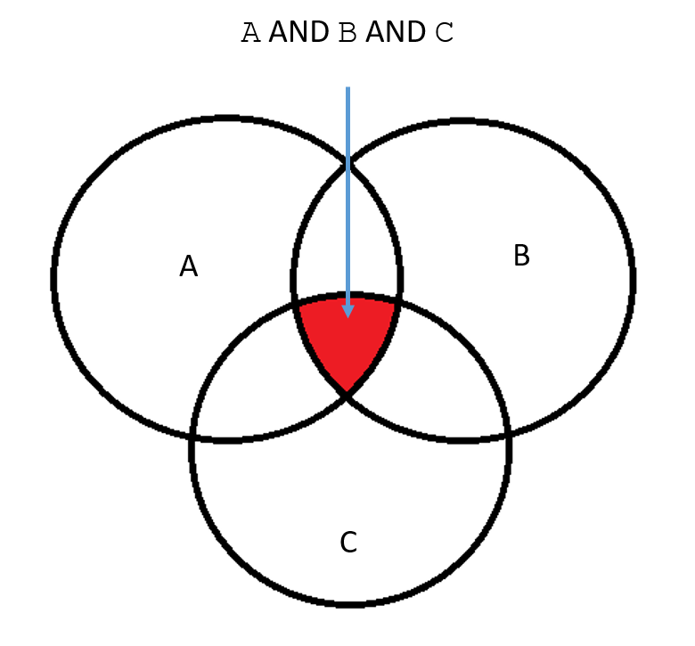
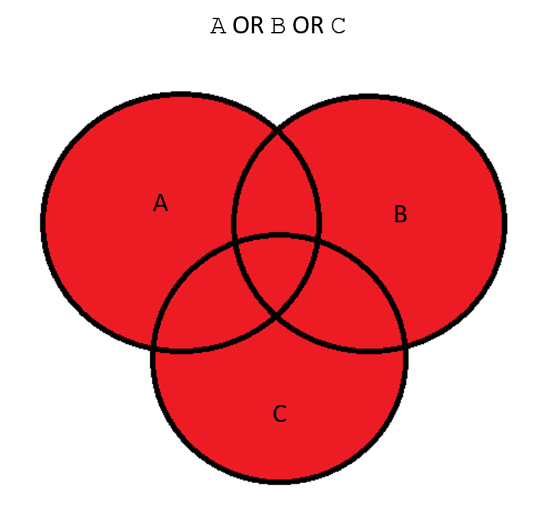

# {{ title }}

Making decisions in programming hinges on evaluating conditional expressions, which result in a value of either `true` or `false`. In C#, `true` is represented as `1` and `false` as `0`. 

## Boolean Logic

Conditional expressions serve as tests that produce these two outcomes. These expressions can be combined using **Boolean operators** based on **Boolean logic**, which is fundamental to computer operations. For our purposes, there are five main Boolean operations:

- AND
- OR
- NOT
- NAND
- NOR

Each operator typically takes two inputs, which we will denote as `A` and `B`, producing a single output, `Q`. These operations are often described using a **truth table**, where `1` represents `true` and `0` represents `false`. 

### AND Operator

The **AND** operator produces a true output, `Q`, only when both `A` and `B` are true. All conditions must be satisfied:

| A | B | Q |
|---|---|---|
| 0 | 0 | 0 |
| 0 | 1 | 0 |
| 1 | 0 | 0 |
| 1 | 1 | 1 |

This can be visualized using a Venn diagram, demonstrating the intersection of conditions for three variables:

<figure markdown="span">
  {width=300}
  <figcaption>A AND B AND C are true</figcaption>
</figure>

In C#, this can be implemented as:

```csharp
if (A && B && C)
{
    // Execute this block if A, B, and C are all true
}
```

### OR Operator

The **OR** operator yields a true output, `Q`, when at least one of the inputs (`A` or `B`) is true:

| A | B | Q |
|---|---|---|
| 0 | 0 | 0 |
| 0 | 1 | 1 |
| 1 | 0 | 1 |
| 1 | 1 | 1 |

The corresponding Venn diagram for three inputs would be:

<figure markdown="span">
  {width=300}
  <figcaption>A OR B OR C are true</figcaption>
</figure>

In C#, this would look like:

```csharp
if (A || B || C)
{
    // Execute this block if any of A, B, or C is true
}
```

### NOT Operator

The **NOT** operator differs from the others as it takes only one input and outputs the opposite (or complement):

| A | Q |
|---|---|
| 0 | 1 |
| 1 | 0 |

<figure markdown="span">
  {width=300}
  <figcaption>NOT A</figcaption>
</figure>

In C#, the NOT operator is represented by an exclamation mark (`!`) preceding the condition:

```csharp
if (!(A && B && C))
{
    // Execute this block when the condition is false
}
```

### NAND and NOR Operators

The final two operators, **NAND** and **NOR**, are simply the negation of the AND and OR operations, respectively:

- **NAND**: NOT (A AND B)
- **NOR**: NOT (A OR B)

### Compound Conditionals and De Morgan's Laws

Working with compound conditional statements can lead to confusion. Consider these two statements:

```csharp
// [1]
if (a >= 0 && a <= 10) { ... }
// [2]
if (a >= 0 || a <= 10) { ... }
```

- The first statement will evaluate to `true` if `a` is in the range of 0 to 10.
- The second statement evaluates to `true` for every value of `a`, since one of the conditions (`a >= 0`) is always satisfied for non-negative values.

Looking back at Venn diagrams, the AND operator represents the **intersection**, while the OR operator represents the **union** of the sets.

If we want to check whether a value is **not** in the range of 0 to 10, we might write:

```csharp
// [3]
if (!(a >= 0 && a <= 10)) { ... }
```

However, simplifying this incorrectly to:

```csharp
// [4]
if (a < 0 && a > 10) { ... }
```

will produce incorrect results. 

### De Morgan's Laws

The laws governing simplification of Boolean expressions were established by the British mathematician Augustus **De Morgan**. These rules state:

- NOT(A AND B) = NOT A OR NOT B
- NOT(A OR B) = NOT A AND NOT B

For our earlier statement [3], we can use De Morgan's laws to rewrite it as:

```csharp
// [5]
if (!(a >= 0) || (!(a <= 10))) { ... }
```

Recognizing that `!(a >= 0)` translates to `a < 0`, and `!(a <= 10)` translates to `a > 10`, we can simplify our expression to:

```csharp
// [6]
if (a < 0 || a > 10) { ... }
```

By removing the NOTs from the conditional, the code becomes clearer and easier to maintain. Applying simplification rules such as De Morgan's laws is a valuable skill in Boolean algebra.
