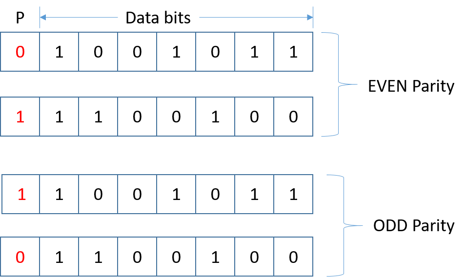

# {{ title }}

Data transmission is prone to errors, which can lead to incorrect or corrupted information being received. To ensure data integrity, several error detection and correction methods are employed. This document explores three such techniques: **parity checking**, **majority voting**, and **check digits**.

## Parity Checking

In **parity checking**, an additional bit, known as a parity bit, is added to a string of binary data. This ensures that the total number of `1` bits in the string is either an odd or even number, depending on the chosen parity:

- **Even Parity**: The total number of `1` bits is even.
- **Odd Parity**: The total number of `1` bits is odd.

Parity checking can detect single-bit errors but cannot correct them.

<figure markdown="span">
  { width="400" }
  <figcaption>Parity Bits</figcaption>
</figure>

Let's use the `BitArray` class from the `System.Collections` namespace to demonstrate how to calculate the parity bit for an integer:

```cs
using System;
using System.Collections;

namespace parity
{
    class Program
    {
        static void Main(string[] args)
        {
            Console.Write("Enter an integer (1..127) > ");
            int inputNumber = Convert.ToInt32(Console.ReadLine());            
            BitArray bits = new BitArray(new int[] { inputNumber });  // Convert to an array of bits
            int count = 0;

            for (int i = 0; i < bits.Length; i++)
            {
                if (bits[i])
                    count++;  // Count the number of 1s
            }

            Console.WriteLine($"{count} 1s in {inputNumber}");

            // Check if the count is odd or even using modulus operator
            if (count % 2 == 1)
            {
                bits[7] = true;  // Set parity bit for even parity
            }

            // Convert back to integer
            int[] resultArray = new int[1];
            bits.CopyTo(resultArray, 0);
            inputNumber = resultArray[0];

            Console.WriteLine($"With parity bit set: {inputNumber}");
        }
    }
}
```

The `BitArray` class represents the bits as `true` (1) or `false` (0). We count the number of `true` values to determine the parity. 

## Majority Voting

**Majority voting** is another error detection method where each bit in the data is duplicated an odd number of times, such as three. This redundancy helps to correct certain errors. For example, the binary data `101` becomes `111 000 111`.

If errors occur during transmission, the receiver takes the majority of each bit group to reconstruct the original data. Although not foolproof, this method can correct some errors without needing retransmission.

Here’s how to implement and test majority voting:

```cs
static void Main(string[] args)
{
    // Get the character to encode
    Console.Write("Enter a character to encode: ");
    char ch = Console.ReadLine()[0];
    string binCode = DecimalToBinary(ch);
    Console.WriteLine($"Encoding {ch} is: {binCode}");

    // Get the number of repetitions for each bit
    Console.Write("Enter number of repeats for each bit: ");
    int repetitions = Convert.ToInt32(Console.ReadLine());
    string newBinCode = "";

    for (int i = 0; i < binCode.Length; i++)
    {
        for (int j = 0; j < repetitions; j++)
        {
            newBinCode += binCode[i];
        }
    }

    Console.WriteLine($"The transmitted code is: {newBinCode}");

    // Introduce errors as a percentage
    Console.Write("Enter percentage of errors to introduce: ");
    int errorPercent = Convert.ToInt32(Console.ReadLine());
    string errorBinCode = "";
    Random rnd = new Random();

    for (int i = 0; i < newBinCode.Length; i++)
    {
        if (rnd.Next(100) < errorPercent)
        {
            errorBinCode += newBinCode[i] == '0' ? '1' : '0';
        }
        else
        {
            errorBinCode += newBinCode[i];
        }
    }

    Console.WriteLine($"Code with errors introduced: {errorBinCode}");

    // Check and correct the errors using majority voting
    string repairedCode = "";
    int n = 0;

    while (n < errorBinCode.Length)
    {
        int count = 0;
        for (int i = 0; i < repetitions; i++)
        {
            if (errorBinCode[n] == '1')
                count++;
            n++;
        }

        repairedCode += count > repetitions / 2 ? '1' : '0';
    }

    Console.WriteLine($"Repaired code is: {repairedCode} or {Convert.ToChar(BinaryToDecimal(repairedCode))}");
}
```

## Check Digits

A **check digit** is a digit added to the end of data to help verify its accuracy. It is commonly used with credit card numbers, bank account numbers, and ISBNs.

For example, the ISBN-13 check digit is calculated as follows:

1. Multiply each digit alternately by 1 and 3.
2. Sum the products.
3. Find the remainder when the sum is divided by 10.
4. Subtract the remainder from 10 to get the check digit.

```cs
static void Main(string[] args)
{
    string isbn = "9781861972712";
    int sum = 0;

    for (int i = 0; i < isbn.Length - 1; i++)
    {
        int n = isbn[i] - '0';
        sum += (i % 2 == 0) ? n * 1 : n * 3;
    }

    int remainder = sum % 10;
    int checkDigit = remainder == 0 ? 0 : 10 - remainder;
    Console.WriteLine($"Check

 digit = {checkDigit}");
}
```

This code uses a ternary operator for compactness, but the logic can be expanded as shown below:

```cs
if (remainder == 0)
{
    checkDigit = 0;
}
else
{
    checkDigit = 10 - remainder;
}
```

## Summary

These error detection methods provide various ways to verify data integrity during transmission. While each has its strengths and weaknesses, they are crucial tools in ensuring accurate data communication.
