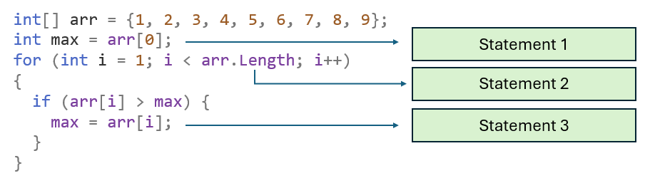

# {{ title }}

(Also see: [Big-O Cheat Sheet](https://www.bigocheatsheet.com))

## What is Big O Notation?

Big O notation is a mathematical tool used to describe the efficiency of an algorithm, focusing on how the running time or space requirements grow as the size of the input increases. It helps computer scientists and programmers compare different algorithms and make informed choices about which algorithm is most appropriate for a given problem, particularly as data sets become larger.

> **Definition:** Big O notation describes the upper bound of an algorithm's time complexity, representing the worst-case scenario for the number of operations required as the input size approaches infinity.

!!! note
    Big O notation ignores hardware factors such as CPU speed and RAM. When determining algorithm efficiency, these factors are not relevant.

### Why is Big O Important?

As computer scientists, we are often faced with choosing between multiple algorithms to solve the same problem. The efficiency of these algorithms can vary significantly, especially when dealing with large inputs. Big O allows us to quantify and compare these algorithms' performance, independent of hardware and implementation details like CPU speed or programming language.

### Understanding Algorithm Efficiency

Let's revisit the **Bubble Sort** algorithm, which we previously described as inefficient. But what does that mean? How do we measure and compare the efficiency of one algorithm against another? This is where Big O notation becomes essential. It provides a formal way to evaluate the performance of algorithms based on how their running time or space requirements grow with increasing input sizes.

## Key Concepts of Big O Notation

- **Time Complexity**: The amount of time an algorithm takes to run as a function of the length of the input.
- **Space Complexity**: The amount of memory an algorithm uses as a function of the length of the input.
- **Worst-case, Best-case, and Average-case**: Describes different scenarios for input sizes, with Big O typically focusing on the worst-case.

## Classifying Algorithms with Big O Notation

**Common Misconceptions**

- Big O Represents Worst-case Only: While Big O often focuses on worst-case scenarios, it can also describe average-case and best-case complexities.
- Encountering O(n!) and O(2^n): These complexities are indicative of very inefficient algorithms and are rarely encountered in everyday programming.

**What's important?**

<figure markdown="span">
  { width="600" }
  <figcaption>Finding the Maximum</figcaption>
</figure>

In the code above, both statement 1 and statement 3 are simple assignment statements.  We'll say they will take one clock cycle each to be executed.  The array, `arr` has 9 elements, so statement 2 will be executed 9 times.  In total, therefore, 11.  If the array increases in size to, say, 100 elements.  Out total will increase to 102.  It is statement 2 that will be having the significant impact on the algorithm,

So, when considering the Big O of an algorithm it is usually the loops we're looking out for!

### Constant Time - $O(1)$

An algorithm is said to run in constant time if the time it takes to complete does not change with the size of the input.

**Example**:

```cs
int[] myList = {1, 2, 3, 4, 5, 6, 7, 8, 9, 10};
int myValue = myList[3]; // O(1)
```

Here, accessing any element in the array will always take the same amount of time, regardless of the array size.

!!! note
    No loops!

### Linear Time - $O(n)$

An algorithm runs in linear time if its time complexity grows proportionally with the size of the input.

**Example**: Finding the maximum value in an array.

```cs
int[] arr = {1, 2, 3, 4, 5, 6, 7, 8, 9};
int max = arr[0]; // O(1)
for (int i = 1; i < arr.Length; i++) { // O(n)
  if (arr[i] > max) {
    max = arr[i]; // O(1)
  }
}
```

The loop runs `n` times, where `n` is the number of elements in the array.

!!! note
    A single loop!

### Quadratic Time - $O(n^2)$

An algorithm runs in quadratic time if its time complexity is proportional to the square of the size of the input, often resulting from nested loops.

**Example**: Nested loops through an array.

```cs
int[] arr = {1, 2, 3, 4, 5, 6, 7, 8, 9};
for (int i = 0; i < arr.Length; i++) { // O(n)
  for (int j = i + 1; j < arr.Length; j++) { // O(n)
    Console.WriteLine(arr[i] + ", " + arr[j]); // O(1)
  }
}
```

The time complexity for this double loop is O(n^2) as every element must be compared with every other element.

!!! note
    A nested loop!
    The general rule is that if you have `k` nested loops, each iterating `n` times, the time complexity will be $O(n^k)$.

### Logarithmic Time - $O(log n)$

An algorithm is said to run in logarithmic time when its time complexity grows proportionally to the logarithm of the input size.

**Example**: Binary Search.

```cs
public static int BinarySearch(int[] arr, int target) {
  int left = 0;
  int right = arr.Length - 1;

  while (left <= right) { // O(log n)
    int mid = (left + right) / 2;
    if (arr[mid] == target) return mid; // O(1)
    else if (arr[mid] < target) left = mid + 1; // O(1)
    else right = mid - 1; // O(1)
  }

  return -1; // Not found
}
```

This search algorithm reduces the problem size by half each time, hence its logarithmic complexity.

### Exponential Time - $O(2^n)$

An algorithm is exponential if its time complexity doubles with each additional input. This is often seen in recursive algorithms.

**Example**: Fibonacci Sequence using naive recursion.

```cs
public static int Fibonacci(int n) {
  if (n <= 1) return n; // O(1)
  return Fibonacci(n - 1) + Fibonacci(n - 2); // O(2^n)
}
```

Each call to the Fibonacci function generates two more calls, leading to exponential growth.

### Factorial Time - $O(n!)$

An algorithm has factorial time complexity when it grows with the factorial of the input size, commonly found in algorithms that generate all possible permutations of an input.

**Example**: Generating permutations of an array.

```cs
public static void GeneratePermutations(int[] arr, int start) {
  if (start == arr.Length - 1) { // O(1)
    // Output the permutation
  }
  
  for (int i = start; i < arr.Length; i++) { // O(n)
    Swap(arr, start, i); // O(1)
    GeneratePermutations(arr, start + 1); // O(n!)
    Swap(arr, start, i); // O(1) - backtrack
  }
}
```

The time complexity here can lead to `n!` growth due to the recursive nature of generating permutations.

## Summary

| Complexity |	Description | 	Example Algorithm |
|:----------:|--------------|---------------------|
|O(1)|	Constant time|	Accessing a list element|
|O(log n)|	Logarithmic time|	Binary Search|
|O(n)|	Linear time|	Linear Search|
|O(n log n)|	Linearithmic time|	Merge Sort|
|O(n^2)	|Quadratic time|	Bubble Sort|
|O(2^n)|	Exponential time|	Recursive Fibonacci|
|O(n!)|	Factorial time|	Traveling Salesman Problem|

### Conclusion

Understanding Big O notation is fundamental for evaluating algorithms and ensuring efficient programming. By analyzing the time and space complexities, programmers can make informed decisions about which algorithms to use based on the expected size of input data.
