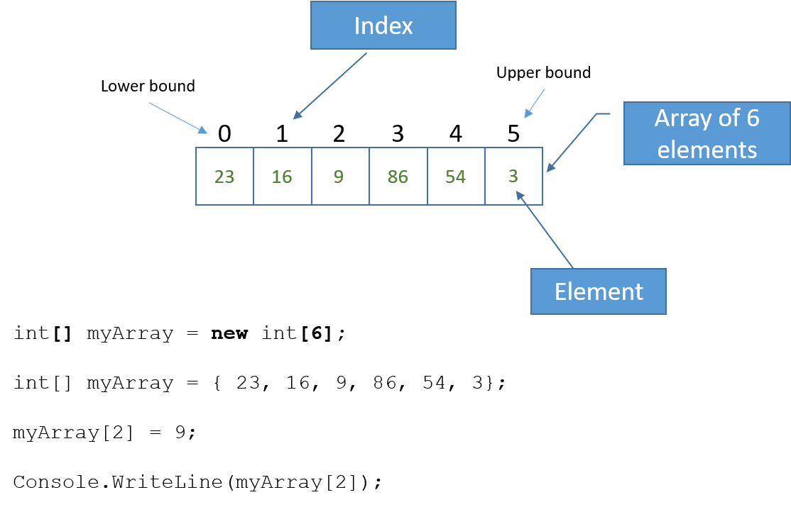

# {{ title }}

!!! note "In this chapter:"
    - The characteristics of an __array__
    - How to __declare an array__ and __initialise__ its values
    - Use an __index__ number of access each element of the array and either set or change its value
    - Loop through each element of the array using either a `for` loop or a `foreach` loop
    - Sort the elements of an array into ascending or descending order
    - Describe the characteristics of a __2D array__, declare and initialise the values
    - Use the row index and column index to access an element in a 2D array
    - Traverse a 2D array using nested for loops and the `GetLength()`` method

So far we have worked with simple data types, such as integers, reals and characters. As programs become more complex, it becomes essential to store larger amounts of data and it is impractical to use simple types to do so. For example, you might need to store and process the marks for a class of $20$ students over a series of $5$ assignments. It is not practical to use $100$ separate integer variables to do this. What would you call them? How would you carry out the same operation on each?  

For such a situation we need to use an __array__.  An array is a collection of variables, known as __elements__, where each element is __the same data type__.  

<figure markdown="span">
  { width="500" }
  <figcaption>Arrays</figcaption>
</figure>

The elements are numbered, starting with $0$, the number acts as an __index__ to access each element.  The first element is known as the __lower bound__ of the array, the last as the __upper bound__.  The lower bound will always by $0$ in C\#.  This is important to remember when iterating through an array, as the upper bound will always be one less than its length (the number of items in the array).  Once it has been initialised the number of elements in the array is fixed.

An array can be multi-dimensional but most commonly one or two dimensions only, anything beyond this gets difficult to manage.

In C\# an array is an __object__, which means it needs to be declared using different syntax.

!!! note "From the syllabus"
    AQA: Single- and multi-dimensional arrays (3.2.1.2/4.2.1.2): Use arrays (or equivalent) in the design of solutions to simple problems
    
    - An array is a data structure that can store multiple values in a single variable.

