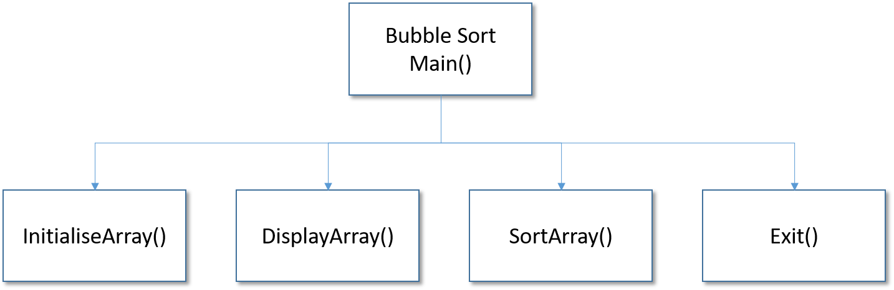

# {{ title }}

!!! note "From the syllabus"
    AQA: Procedural-oriented programming (3.1.1.10/4.1.2.2) - Be able to construct and use hierarchy charts when designing programs.
        - Hierarchy charts are created by the programmer to help document a program. They convey the big picture of the modules (or functions) used in a program.

It's often helpful to visualise the structure of a program.  One of the tools we can use is the __Hierarchy chart__ (sometimes called __structure diagram__).  The diagram shows the relationship between the methods, ignoring any of the logic within those methods, but does show where methods are dependent on other methods.  Hierarchy charts are an important tool in documenting a solution.

For example, the bubble sort program above can be visualised in the following hierarchy chart:

