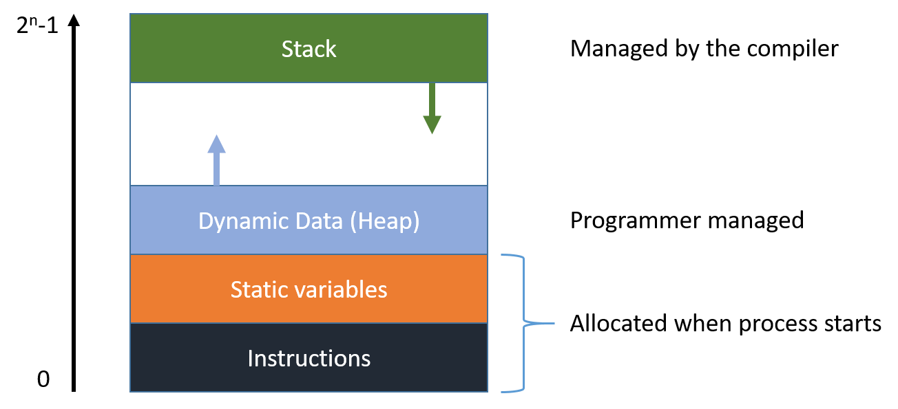
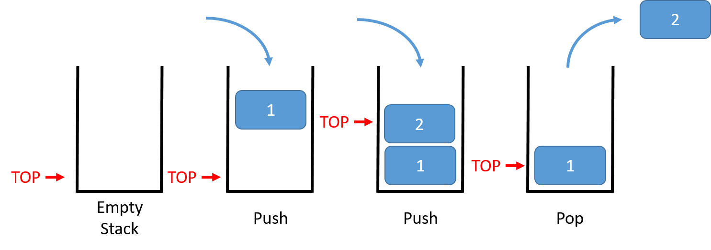

# {{ title }}

The concept of the __stored program__, introduced by John von Neumann in the 1940s, proposed that program instructions and data be stored together in a memory device. This idea revolutionized computing, enabling machines to switch between multiple programs stored in memory, rather than being limited to executing a single program at a time.

A von Neumann machine consists of three key components:

  - **Central Processing Unit (CPU)**: The brain of the computer, responsible for executing instructions.
  - **Memory**: Stores both data and instructions.
  - **Input/Output Devices (I/O)**: Facilitate interaction between the computer and the outside world.

## CPU and Its Components

The CPU, at the heart of a computer, contains three main components:

- **Arithmetic Logic Unit (ALU)**: Performs mathematical and logical operations on data.
- **Control Unit (CU)**: Manages the execution of instructions, coordinating the CPU's operations.
- **Registers**: Small, fast storage locations within the CPU used to hold temporary data and instructions.

## Memory Hierarchy

Memory in a computer is organized hierarchically to optimize performance:

1. **Secondary Storage**: Includes hard drives and SSDs, used for long-term data storage.
2. **Primary Memory (RAM)**: Used to store data and instructions that the CPU needs while executing programs.
3. **Cache Memory**: A small, fast type of memory located close to the CPU, used to store frequently accessed data.
4. **Registers**: The fastest type of memory, used for immediate data storage and manipulation.

The higher up the hierarchy, the faster the memory access times for the CPU.

## Memory Addressing

All computer memory is divided into locations, each identified by a unique number called an __address__. The basic storage unit is a byte ($1$ byte = $8$ bits), but modern CPUs often read and write data in __word__-sized chunks, typically $32$-bit ($4$ bytes) or $64$-bit ($8$ bytes). Even though data may be read or written in word-sized chunks, the addresses are still byte-referenced.

For example, an `int` data type in C# is $4$ bytes, meaning the value stored will occupy $4$ consecutive memory locations.

### Logical vs Physical Memory

When a program runs, it is allocated memory, now referred to as a __process__. To the program, memory appears as a contiguous block of addresses, known as __logical memory__. However, the actual physical locations in RAM may be scattered. The operating system handles the mapping between logical and physical addresses, a process known as __memory management__.

### Memory Layout of an Executing Program

The memory allocated to a running program typically looks like this:

<figure markdown="span">
  { width="500" }
  <figcaption>Allocation of memory to a program</figcaption>
</figure>

1. **Code Segment**: Contains the compiled machine code instructions of the program.
2. **Data Segment**: Stores global and static variables.
3. **Heap**: Allocates memory for dynamic data structures such as objects or arrays created with the `new` keyword. The heap grows upwards in memory.
4. **Stack**: Manages function calls and local variables. It grows downwards in memory.

If the heap and stack collide (e.g., due to excessive dynamic memory allocation or deep recursion), a stack overflow or out-of-memory error can occur.

## Understanding the Stack

The stack is a crucial part of memory management for function calls. It operates on a last-in, first-out (LIFO) principle, much like a stack of books. The stack is used to:

- Store function call information such as parameters, return addresses, and local variables.
- Manage the sequence of function calls and returns.

In programming terms:

- __Push__: Add an item to the top of the stack.
- __Pop__: Remove an item from the top of the stack.

### Calling a Method

Consider the following C# example where the `Add()` method is called from the `main()` program:

```csharp
static void Main(string[] args)
{
    int x = 3;
    int y = 4;
    Console.WriteLine("Simple adding method");
    int sum = Add(x, y);
    Console.WriteLine($"The sum is {sum}");
}

static int Add(int a, int b)
{
    int sum = a + b;
    return sum;
}
```

Here, `Main()` is the __caller__, and `Add()` is the __callee__. For this call to execute correctly, several things must happen:

1. **Passing Parameters (`x` and `y`)**: 
   - The values of `x` and `y` are pushed onto the stack before the method call. Parameters are typically pushed in reverse order (last parameter first).

2. **Saving the Return Address**: 
   - The address of the next instruction to be executed after the `Add()` method (the instruction `Console.WriteLine($"The sum is {sum}");`) is pushed onto the stack.

3. **Creating a Stack Frame**:
   - A new stack frame is created for the `Add()` method, containing space for its parameters, local variables, and the return address.

4. **Returning from the Method**:
   - When `Add()` finishes executing, it pops the return address from the stack and places the return value in a predefined location (typically a register). Control then returns to the instruction following the method call.

### The Stack in Detail

<figure markdown="span">
  { width="600" }
  <figcaption>Stack operations</figcaption>
</figure>

1. **Push Return Address**: The address to which control should return after the method completes is pushed onto the stack.
2. **Push Parameters**: Parameters for the method are pushed onto the stack.
3. **Execute Method**: The method uses the stack to access its parameters and allocate local variables.
4. **Pop Items**: After the method completes, the parameters and return address are popped off the stack, restoring the stack to its previous state.

If a method calls another method (or itself in a recursive call), a new stack frame is created, and the process repeats. Each method call is thus isolated in its own __stack frame__.

### Practical Implications

In high-level languages like C#, the details of stack management are handled by the runtime environment. This abstraction allows developers to focus on writing code without worrying about the underlying mechanics. However, in low-level languages like assembly, programmers must manage the stack explicitly, making it crucial to understand these concepts.

In summary, the call stack is a vital part of program execution, ensuring that function calls and returns occur in the correct order and that data is passed between methods effectively. Understanding how the stack works will deepen your understanding of how programs execute at a low level, even if you usually work with high-level languages.

By keeping these concepts in mind, you'll gain a better grasp of how the CPU and memory work together to execute complex programs.
