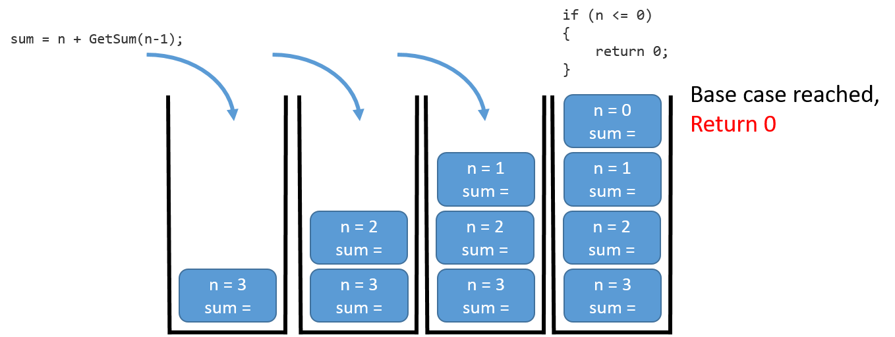
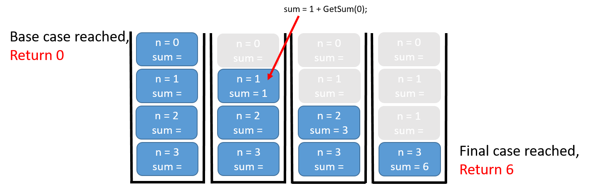

In the following sections, we'll explore several "classic" algorithms to gain more experience in viewing problems through the lens of recursion.

## Summing a List of Integers

This is a simple problem, similar to the previous examples, but here the method returns a value, making it a function.

### Iterative Solution

Let's start with an iterative approach:

```cs
static void Main(string args[])
{
    int sum = GetSum(4);
    Console.WriteLine(sum);
}

static int GetSum(int n)
{
    int total = 0;
    for (int i = 0; i < n; i++)
    {
        total += i;
    }
    return total;
}
```

We expect the result `6` to be printed to the screen, not `10` as initially stated. The sum of the numbers from 0 to 3 is `0 + 1 + 2 + 3 = 6`.

To sum a given set of numbers `{1, 2, 3, 4}`, we could represent it as `4 + 3 + 2 + 1`. This helps us frame a recursive solution to the same problem:

### Recursive Solution

```cs
static int GetSum(int n)
{
    if (n <= 0)
    {
        return 0;
    }
    int sum = n + GetSum(n - 1);
    return sum;
}
```

In this recursive solution, we add the current number `n` to the sum of all numbers less than `n`. The recursive function is called repeatedly, decreasing `n` by 1 each time, until it reaches the base case (`n <= 0`), where it returns `0`.

### Understanding the Call Stack

The key to understanding recursion lies in how the call stack works. Let's trace the execution for `n = 3`:

1. `GetSum(3)` is called.
2. `3 + GetSum(2)` is evaluated.
3. `2 + GetSum(1)` is evaluated.
4. `1 + GetSum(0)` is evaluated.
5. `GetSum(0)` returns `0`, triggering the unwinding of the recursive calls.

The accumulated result is `3 + 2 + 1 + 0 = 6`. 

### Visualizing the Stack

It's beneficial to visualize how the stack "winds" and "unwinds" as recursive calls are made and returned. The figures below illustrate this concept:

<figure markdown="span">
  { width="650" }
  <figcaption>Winding up the methods</figcaption>
</figure>

<figure markdown="span">
  { width="700" }
  <figcaption>Unwinding the methods</figcaption>
</figure>

### Avoiding Infinite Recursion

Be careful! Recursion without a proper base case leads to **infinite recursion**, which results in a _stack overflow_. This happens when the system runs out of memory to allocate to the stack, causing the program to crash.

## Converting an Integer to a String (in Any Base)

Let's build a recursive solution to convert an integer into a string representation in any base, such as decimal (base 10) or binary (base 2).

We start with a simple case: converting the integer `245` into the string `"245"` or the binary string `"1110101"`. We will use a lookup string `convToString = "0123456789ABCDEF"`. For example, `convToString[5]` returns `"5"`. The task is to decompose the number `245` into its individual digits (`2`, `4`, and `5`), and use these as indices to the lookup string.

### Steps in the Conversion

1. **Reduce the Number**: Break the number into its individual digits.
2. **Convert to String**: Use the lookup string to convert each digit.
3. **Concatenate Strings**: Combine the digit strings in the correct order.

The base case occurs when the number is less than the base itself. For example, dividing `245` by `10` yields `24` with a remainder of `5`. The remainder `5` is converted first, then we move to `24`, and so on, until a single digit remains.

Here's the recursive function:

```cs
static string DecToAnyBase(int n, int b)
{
    string ch = "0123456789ABCDEF";
    if (n < b)
        return ch[n].ToString();
    else
        return DecToAnyBase(n / b, b) + ch[n % b].ToString(); 
} 
```

## Factorial

The factorial function (`n!`) is a classic example of recursion. It's not because recursion is the best way to compute factorials, but because it's easy to understand the concept using this problem.

Recall that the factorial of a number `n` is the product of all integers from `1` to `n`. By definition, `0! = 1`.

Here's how some factorials are calculated:

```bash
0! = 1
1! = 1 * 1
2! = 2 * 1
3! = 3 * 2 * 1
4! = 4 * 3 * 2 * 1
5! = 5 * 4 * 3 * 2 * 1
6! = 6 * 5 * 4 * 3 * 2 * 1
```

Alternatively, factorials can be defined recursively as:

```bash
0! = 1
n! = n * (n - 1)!
```

Let's implement this using a recursive function:

```cs
static int Factorial(int n)
{
    if (n == 0)
        return 1;            // base case
    else
        return n * Factorial(n - 1);  // recursive call
}
```

This function can be called as follows:

```cs
Console.WriteLine(Factorial(5));  // Output: 120
```

Notice how the mathematical definition of factorial closely matches the recursive implementation.

## Summary

1. **Trace Execution**: Always trace the execution of recursive functions to understand their behavior.
2. **Base Case**: Ensure every recursive function has a proper base case to avoid infinite recursion.
3. **Efficiency**: Recursion can be elegant, but it's not always the most efficient solution compared to iterative methods.
