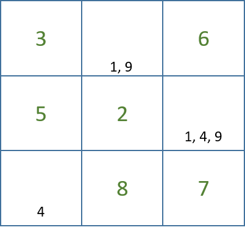

# {{ title }}

__Consider this section as ADVANCED but introduces an application where a recursive solution is the best way to go.  The concepts here of searching through a problem space is usually considered in later texts on programming when advanced data structures such as trees and graphs are covered.__

With more than a passing nod to the __Latin Square__ of Euler (1707-1783) the Sudoku puzzle has grown in popularity, most daily papers will publish a Sudoku challenge alongside a daily crossword and books of the puzzle can be bought in local bookshops.  The principle is simple: given a $9$ x $9$ grid that contains some scattered numbers and blanks, complete the puzzle in such a way that each row, column and $3$ by $3$ region contains each of the digits $1$ to $9$.  

There is a problem set on [Project Euler](https://projecteuler.net/index.php?section=problems&id=96) that provides a number of sample sudoku problems to solve.  The problem set there is to sum the first three digits in the first row of each the given problems.  We'll not get there but will use the example puzzles in our solution.

To think how we might solve such a problem consider this sample:

<figure markdown="span">
  { width="300" }
  <figcaption>Empty Sudoku puzzle</figcaption>
</figure>


If you've never tried to complete a Sudoku with pen and paper, look at the $3$ x $3$ region in the top left hand corner.  The three empty squares must each contain one of either ${[1, 4, 9]}$, but how can you work out which goes where?

We could adopt a __brute force__ approach:

- Select an empty square
- Pick a number between $1$ and $9$
- If this number is not repeated in either target row, column or region then write in that number, else pick an alternative number
- If none of our numbers meet the conditions in the previous step, a mistake has been made so __backtrack__ to the previous position
- Repeat until the puzzle has been solved.

NB.  We use the term _region_ to denote the $3$ by $3$ sub-grid.

If you think that's a lengthy, time-consuming process you'd be right and it would be daft to take this approach manually.  However, we have a computer well capable of handling millions of instructions per second so we can implement this tactic and get a result relatively quickly.

It's worth pausing briefly to consider how we might improve on our brute-force algorithm.  One of the first steps taken by a manual Sudoku solver is to list the candidate numbers for each cell:

<figure markdown="span">
  { width="300" }
  <figcaption>Sudoku solving</figcaption>
</figure>


This approach will reduce the run-time of our algorithm considerably, instead of picking a random number between $1$ and $9$ we select one of the candidates from the list of possible values.  We are __optimising__ our potential solution space through a process known as __minimisation__.  Once we've placed a number in a cell, e.g. $4$ in the above grid this is no longer a candidate in its respective row, column or region and the candidates need to updated e.g. middle row, far right.  This is called __constraint propagation__ but, of course, occurs across the whole of the Sudoku grid.

In our sample region we'd then be left knowing that $1$ and a $9$ will be in these empty squares but we do not know which just yet.  A manual solver would then look to see if there is another cell with just these candidates in a respective row, column or region thus being able to eliminate these values as candidates from the other cells in that row, column or region.

In this case, we're left with a singleton, $4$, in one of the squares so this can be filled in, removing $4$ from the candidates in the far right column.  We can go no further using such a process for this region.

A further optimisation we might apply is to start in the region with the least number of unassigned cells.  It stands to reason that the top left region has less to do in searching for possible solutions than the region to its right.

We could continue in this way to mimic the manual solver's process but it would take a lot of code and is not required as we can use the computer to __search__ for the correct solution.  The solution we'll consider does involve some minimisation as we'll only be selecting those values not currently assigned in the target row, column or region.

If interested in the manual approach [this page provides a good summary](https://www.conceptispuzzles.com/index.aspx?uri=puzzle/sudoku/techniques)

### Backtracking

Backtracking is one of those situations where a recursion is better than trying an iterative solution.

The principle is to work through all possible configurations for a particular search space, if we arrive at a dead end (i.e. no solution possible) we backtrack to the most recent successful solution and try again.  You can think of working your way out of a maze, if you move up and then find a wall you return to the previous place and try moving to the right and so on.

Backtracking can be used to solve a Sudoku puzzle.  When given a partially completed grid we find the first square that is empty.  We can only use the numbers from $1$ through to $9$ so we start by checking if $1$ would be valid i.e. there are no others $1$s in that row, column or region, if there are move on to $2$ and so on.

Then move to the next empty square following the same process.  If you reach a point where none of our nine values are valid, we need to back track by unmaking our last decision and trying again.

Checking for the presence of a value in a row, column or region can be implemented as:

```cs
static bool IsValid(int[,] grid, int row, int col, int num)
{
    return !UsedInRow(grid,row,num) &&
            !UsedInColumn(grid,col,num) &&
            !UsedInRegion(grid,row-row%3,col-col%3,num);
}
```

The `grid` being represented as a 2D array of integers.

Our helper methods here are:

```cs
static bool UsedInRow(int[,] grid, int row, int num)
{
    for(int col = 0; col < 9; col++)
    {
        if(grid[row,col] == num) return true;
    }
    return false;
}

static bool UsedInColumn(int[,] grid, int col, int num)
{
    for(int row = 0; row < 9; row++)
    {
        if(grid[row,col] == num) return true;
    }
    return false;
}

static bool UsedInRegion(int[,] grid, int startRow, int startCol, int num)
{
    for(int row = 0; row < 3; row++)
    {
        for(int col = 0; col < 3; col++)
        {
            if(grid[row+startRow,col+startCol] == num)
                return true;
        }
    }
    return false;
}
```

There should be no surprises here, we iterate through each of the values in either the row, column or region and return `false` if not found, `true` otherwise.

The backtracking happens in the `Solve()` method:

```cs
static bool solve(int[,] cells)  
{  
    for (int i = 0; i < cells.GetLength(0); i++)        // loop through each row ...
    {  
        for (int j = 0; j < cells.GetLength(1); j++)    // ... and column
        {  
            if (cells[i, j] == UNASSIGNED)              // we have an empty cell
            {  
                for (int num = 1; num <= 9; num++)      // try each number from 1 to 9
                {  
                    if(IsValid(cells,i,j,num))          // it looks OK ...
                    {  
                        cells[i, j] = num;              // assign that value to the empty cell

                        if (solve(cells))               // recurse through the other cells
                        {
                            return true;                // the puzzle has been solved
                        }
                        else  
                            cells[i, j] = UNASSIGNED;   // problem: it didn't work so make the cell empty
                    }                                   // triggering the backtracking
                }  
                return false;  
            }  
        }  
    }
    return true;  
}
```

Using the code above, create a Sudoku solver.  Initially, hardcode the grid:

```cs
int[,] grid = new int[9,9]
    {
        { 3, 0, 6, 5, 0, 8, 4, 0, 0 },
        { 5, 2, 0, 0, 0, 0, 0, 0, 0 },
        { 0, 8, 7, 0, 0, 0, 0, 3, 1 },
        { 0, 0, 3, 0, 1, 0, 0, 8, 0 },
        { 9, 0, 0, 8, 6, 3, 0, 0, 5 },
        { 0, 5, 0, 0, 9, 0, 6, 0, 0 },
        { 1, 3, 0, 0, 0, 0, 2, 5, 0 },
        { 0, 0, 0, 0, 0, 0, 0, 7, 4 },
        { 0, 0, 5, 2, 0, 6, 3, 0, 0 }
    };
```

Then call your method to `Solve()`.  You'll need to write your own method to print the grid to the screen.

As an __extension__, take a look at the problem set on the [Project Euler](https://projecteuler.net/index.php?section=problems&id=96) page.  This provides a text file of fifty Sudoku problems.  You'll need to read ahead to see how to load these from a file into an array of grids.
