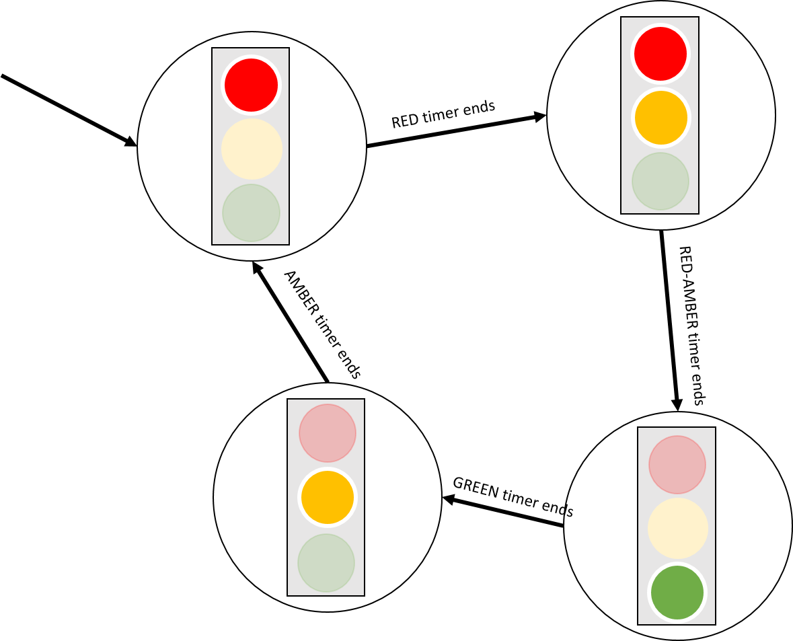

# {{ title }}

A **state machine** is an abstract concept used to model systems that transition between different states based on inputs. In both the real world and in programming, state machines are more common than we might realize. For example, an ATM transitions through a sequence of states such as waiting for card insertion, PIN verification, and dispensing cash. Each state only accepts specific inputs, guiding the system through a controlled sequence of operations.

Another familiar example is a vending machine: after inserting coins, the machine transitions to a state where it can accept your item selection, dispense the item, and then return to an idle state.

State machines are particularly useful when designing systems where the outcome is dependent on a sequence of events or inputs. Consider a simple light switch: it has two states, "on" and "off", and can transition between these states when a user interacts with the switch.

<figure markdown="1">
  { width="200" }
  <figcaption>Figure 1: Light Switch</figcaption>
</figure>

## What is a Finite State Machine?

A **finite state machine (FSM)**:

- Can be in one of a finite number of defined states at any given time.
- Transitions from one state to another in response to a specific input or event.

This behavior can be represented using a **state-transition diagram**, where each state is represented as a circle (or ellipse) and the transitions between states are represented as arrows.

<figure markdown="1">
  { width="700" }
  <figcaption>Figure 2: State-transition diagram for a light switch</figcaption>
</figure>

In the diagram above, the greyed-out transitions represent **redundant actions**, meaning these transitions do not cause any state change. While it is sometimes useful to show these, they can clutter the diagram. Use them judiciously to avoid unnecessary complexity.

## Example: Traffic Lights

A classic example of an FSM is a set of traffic lights. In the UK, traffic lights typically transition through the following states:

1. Red light on, amber off, green off
2. Red light on, amber on, green off
3. Red light off, amber off, green on
4. Red light off, amber on, green off

Each of these states is associated with an **output**, and the transitions between them occur based on a timer.

<figure markdown="1">
  { width="300" }
  <figcaption>Figure 3: State of traffic lights - Red on, Amber off, Green off</figcaption>
</figure>

The **state** represents the configuration of the lights (which lights are on or off), and the **transition** between states is triggered by a timer.

### State-Transition Diagram for Traffic Lights

The following diagram illustrates the state transitions for the traffic lights:

<figure markdown="1">
  { width="500" }
  <figcaption>Figure 4: Traffic light state-transition diagram</figcaption>
</figure>

The system starts in the "red" state, transitions to the "red-amber" state, then to the "green" state, and finally to the "amber" state before returning to "red". This cycle repeats indefinitely.

### State Transition Table

We can also represent the traffic light FSM using a **state transition table**:

| State        | Input | Next State  |
|--------------|-------|-------------|
| S0: RED      | Timer | S1: RED-AMBER |
| S1: RED-AMBER| Timer | S2: GREEN   |
| S2: GREEN    | Timer | S3: AMBER   |
| S3: AMBER    | Timer | S0: RED     |

This table helps us understand how the FSM transitions between states based on the input (in this case, a timer).

## State Machines in Code

Implementing a traffic light FSM in C# could use a `switch` statement to handle state transitions. The current state changes based on the `case` that matches the current state.

### Example: Traffic Light FSM in C#

First, we define an `enum` for the states:

```cs
enum State 
{
    RED, RED_AMBER, AMBER, GREEN
}
```

Then, we implement the state transitions using a `switch` statement:

```cs
State currentState = State.RED;

switch(currentState)
{
    case State.RED:
        currentState = State.RED_AMBER;
        break;
    case State.RED_AMBER:
        currentState = State.GREEN;
        break;
    case State.GREEN:
        currentState = State.AMBER;
        break;
    case State.AMBER:
        currentState = State.RED;
        break;                            
}
```

We can encapsulate this logic within a `struct`:

```cs
public struct TrafficLight
{
    public State currentState { get; set; }

    public TrafficLight(State stateStart)
    {
        currentState = stateStart;
    }

    public string Change()
    {
        switch(currentState)
        {                  
            case State.RED:
                currentState = State.RED_AMBER;
                break;
            case State.RED_AMBER:
                currentState = State.GREEN;
                break;
            case State.GREEN:
                currentState = State.AMBER;
                break;
            case State.AMBER:
                currentState = State.RED;
                break;                            
        }   
        return currentState.ToString();
    }
}
```

And then use this in the main program:

```cs
static void Main(string[] args)
{
    TrafficLight tl = new TrafficLight(State.RED);
    Console.WriteLine("Starting on " + tl.currentState);  // RED
    Console.WriteLine("Moving to   " + tl.Change());      // RED_AMBER
    Console.WriteLine("Moving to   " + tl.Change());      // GREEN
    Console.WriteLine("Moving to   " + tl.Change());      // AMBER   
}
```

The output for this traffic light FSM depends solely on the current state, classifying it as a **Moore Machine**.

## More Advanced FSM Examples

### Even Parity Checker

An FSM can also be used to check if a binary string has an even number of ones. The FSM transitions through states representing even or odd parity based on the input bits.

<figure markdown="1">
  { width="600" }
  <figcaption>Figure 5: FSM for checking even parity</figcaption>
</figure>

### Validating an Alphabet String

We can use an FSM to validate whether a string conforms to a specific pattern. For instance, consider a string that must follow the pattern "abac" exactly:

<figure markdown="1">
  { width="400" }
  <figcaption>Figure 6: FSM for validating alphabet pattern</figcaption>
</figure>

The state transitions for this FSM are represented in a `switch` statement, similar to the traffic light example.

### Vending Machine Example

Consider a vending machine that accepts 10p, 20p, and 50p coins to purchase a drink costing 50p. The machine transitions between states based on the total amount inserted.

<figure markdown="1">
  { width="500" }
  <figcaption>Figure 7: FSM for vending machine</figcaption>
</figure>

This FSM, where the output is determined by both the current state and input, is a **Mealy Machine**.

## Summary

Finite State Machines are a powerful tool for modeling systems that transition between different states based on inputs. They are used in a variety of contexts, from traffic lights to vending machines to game logic. Understanding FSMs can greatly enhance our ability to design and implement complex systems in a structured and manageable way.

By modeling a system with an FSM, we gain a clearer understanding of its possible states, the allowed transitions between those states, and the inputs that trigger those transitions. This structured approach leads to better-designed and more reliable systems.
