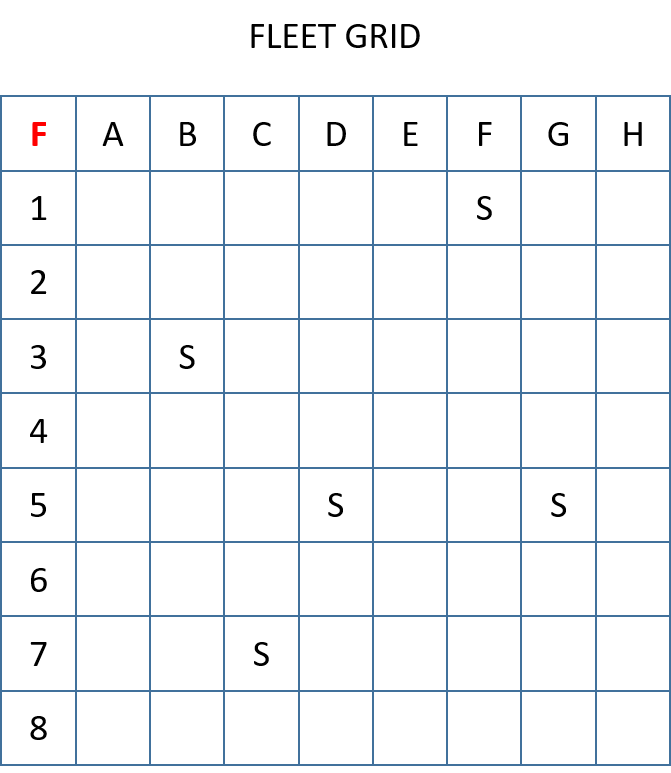
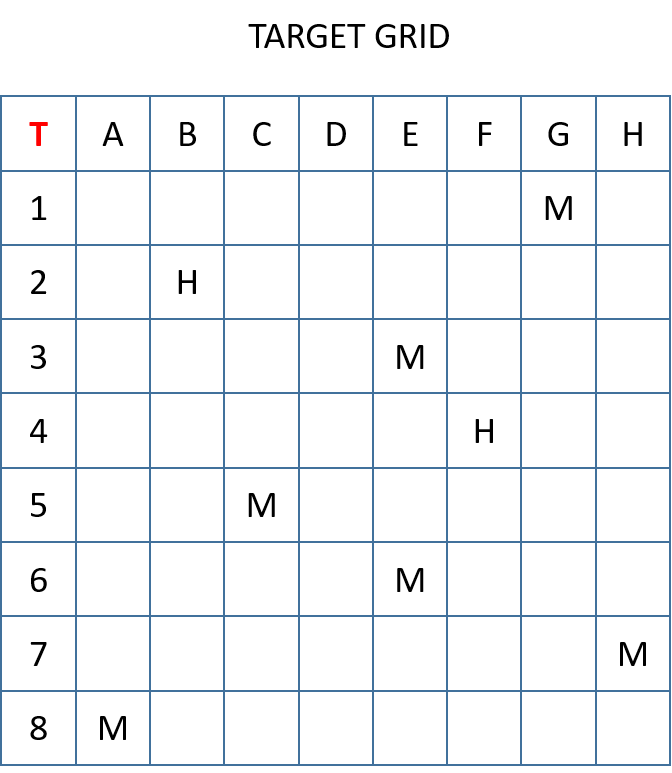

# {{ title }}

BattleShip is a turn based strategy game where players eliminate their opponents fleet of boats by 'firing' at a location on a grid in an attempt to sink them. The first player to sink all of their opponents boats is declared the winner.  

Each player has two eight by eight grids. The first, the __Fleet Grid__ is used for their own battle boats, marked with a 'B' in the diagram:

<figure markdown="span">
  { width="300" }
  <figcaption>Fleet Grid</figcaption>
</figure>

The second is used to record any hits or misses placed on their opponent:

<figure markdown="span">
  { width="300" }
  <figcaption>Target Tracker Grid</figcaption>
</figure>

At the beginning of the game, players decide where they wish to place their fleet of five boats.  Once placed, players take it in turns to fire at a location on their opponent's board. They do this by stating the coordinates for their target. If a player hits their opponent's boat then this is recorded as a hit ('H'). If they miss then this is recorded as a miss ('M').  

The game ends when a player's fleet of boats have been sunk. The winner is the player with boats remaining at the end of the game.

**You have been asked to design a BattleShip game where the player fights against the computer to try and defeat its fleet.**