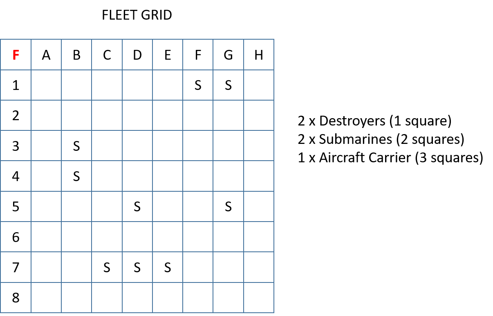

# {{ title }}

1. Extend the game so that the user can play a version of the game that uses a variety of ships.  The ships will come in three categories:

    - 2 x Destroyers (1 cell)
    - 2 x Submarines (2 cells)
    - 1 x Carrier (3 cells)

    The boats can be placed horizontally or vertically.

    <figure markdown="span">
        { width="450" }
        <figcaption>New Fleet</figcaption>
    </figure>
    

2. To allow for varying boat sizes. Develop the program so that it now checks for a hit, a miss and a sunken boat. The boat will only sink if all parts of the boat have been hit.