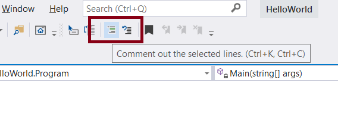

# {{ title }}

## Downloading and installing Visual Studio

Visual Studio is a professional level __Integrated Development Environment__ (IDE) from Microsoft.  There is a free version, known as the __Community Edition__ available from the [Microsoft website](https://visualstudio.microsoft.com/downloads/).  On that page, at time of writing, there are three options:

- Visual Studio
- Visual Studio Code
- Visual Studio for Mac

Click the download button for Visual Studio, selecting the latest Community Edition.

<figure markdown="span">
  { width="400" }
  <figcaption>Download Visual Studio Community Edition</figcaption>
</figure>


Note, to run Visual Studio you will need the following minimum specification:

- Windows operating system, anything later than Windows 7 will be OK, and 64-bit is recommended
- 1.8 GHz processor (quad-core recommended)
- A minimum of 2Gb of RAM, though the more you have the better
- Up to 2Gb of storage space on your hard drive, using an SSD will impact performance significantly
- Video card supporting 1280 by 720 display resolution
- .NET Framework (this ill be installed if not present during installation)
- Latest Windows updates

You need administrator rights to install Visual Studio.

The installer includes everything you need to both install and customise the Visual Studio environment. Once you've clicked through the license terms and privacy statement from Microsoft you'll be presented with the installation options, or __workloads__.  As a minimum, for this text, select ".NET desktop development".

<figure markdown="span">
  { width="400" }
  <figcaption>Select the workload</figcaption>
</figure>


## Tour of the Visual Studio IDE

When you first launch Visual Studio you're presented with the following screen:

<figure markdown="span">
  { width="400" }
  <figcaption>Load a Project in Visual Studio</figcaption>
</figure>

The options should be self-explanatory.

On selecting "Create a New Project" you'll be presented with a number of __templates__ that contain the basic files and settings for a variety of different project types.  You can use the search box at the top of this page or use the drop down boxes to filter the selections:

<figure markdown="span">
  { width="400" }
  <figcaption>Create new project in Visual Studio</figcaption>
</figure>

Here, we've selected a new Console App project.

The next window provides some options for your new project such as its name and directory etc:

<figure markdown="span">
  { width="400" }
  <figcaption>Configure new project in Visual Studio</figcaption>
</figure>


Having set those options the main IDE will start and you'll be presented with the following window:

<figure markdown="span">
  { width="400" }
  <figcaption>Main Editor Window in Visual Studio</figcaption>
</figure>

The larger pane is the __code editor__, here is where you write your code.

To the right is the __solution explorer__ that displays a graphical representation of the files and directories in your solution.  Use this to navigate and open an alternative file in your solution by double-clicking on its name.

The __menu bar__ is as you might expect where commands are grouped into various categories.  Spend some time exploring these commands to see what is available.  The __toolbar__ is beneath the menu and provides shortcuts to some frequently used commands.  The one used most often perhaps will be the green play button.  This shortcut builds (compiles) your project code and then runs it within Visual Studio.

To the bottom left are some some other useful windows:

- __Error List__: if there is a problem when compiling or running the error messages will appear in this window.
- __Output window__: shows messages from building your project files
- __Task List__: another useful feature, this window tracks comments and lists those that begin with ```TODO:```.  Use this to remind yourself of code waiting to be written or changed.

## Using the Code editor

### Snippets

The code editor provides a number of handy shortcuts for speeding up the process of writing code.  One is the use of __code snippets__.  You can find what these are through the __Edit > Intellisense > Insert snippet__ menu.

For example:

- ```cw``` then pressing the tab key twice will insert ```Console.WriteLine();```
- ```for``` then pressing the tab key twice will insert a for loop snippet
- ```if``` following by double tab will insert an if statement

### Commenting

Commenting blocks of code can be achieved using the buttons on the toolbar:

<figure markdown="span">
  { width="400" }
  <figcaption>Commenting code in Visual Studio</figcaption>
</figure>

The first button will comment out any selected lines of code, the second reverse that process.

### Folding

To the left of the code you'll see a small box with a minus sign, ```-```.  Click any of these and the code will fold, or collapse and the indicator changes to a plus sign, ```+```.

This is handy when you have a lot of code and only want to focus on a small section.

### Intellisense

As you enter code the editor's Intellisense function will kick in providing prompts for what it is expecting you to type.  Pressing tab twice on the suggestion will insert that word into your code.

### Renaming

Should you choose to rename a variable or method select the word to be changed and use the context menu (right click of the mouse) and select ```Rename```.  In the code editor make the changes to the identifier being changed then click Apply.  Now all instances of that identifier will have been updated in your code.

## Projects and Solutions

A Visual Studio __Solution__ is a container for one or more related __projects__.  Think of a solution as a house and a project of rooms in that house, the rooms can be linked together.

When starting Visual Studio one of the options is "Create New Project".  This is misleading as it should be "Create New Solution", though the solution will only have one project file.

We can add new projects to our solution by right-clicking on the Solution Explorer pane, selecting the top-most entry labelled __Solution '\<SolutionName\>'__ and clicking __Add Project__.  You might use this when adding a library of code, a class library, for your your application, or a project to handle a Console interface etc..

Where one project requires code in another we need to add a __reference__ to that project by selecting __Dependencies__  and using the context menu to __Add Project Reference ...__

## The Debugger

An essential tool in any software developer's armoury.

We'll use the following code to demonstrate:

```cs
static void Main(string[] args)
{
    int a;
    int b;
    int result;
    Console.Write("Enter a value for a: ");
    a = Convert.ToInt32(Console.ReadLine());
    Console.Write("Enter a value for b: ");
    b = Convert.ToInt32(Console.ReadLine());
    if (a > b)
    {
        result = a + b;
    }
    else
    {
        result = a * b;
    }
    Console.WriteLine($"The result is {result}");
    Console.ReadKey();
}
```

### Setting a breakpoint

Click in the grey gutter to the left of one of the lines of code:

<figure markdown="span">
  { width="400" }
  <figcaption>Setting a breakpoint</figcaption>
</figure>

Now, when you run the code execution will stop, or break, on that line.

From this point the degugging toolbar has a number of options:

<figure markdown="span">
  { width="400" }
  <figcaption>Debugging Toolbar</figcaption>
</figure>

- __Stop__ will cease execution ofthe program
- __Restart__, the next button restarts execution
- __Step Into__, where the code is on a method call this button will go to that method and run the next line of code
- __Step Over__, this runs the method call without stepping into it line by line

### Inspecting the state

Once the program has been paused we can look at the __state__ of the program i.e. the contents of its variables.  This is one of the most useful aspects of debugging and there are different ways of inspecting date.

Hover over an object, a variable name for example, and its current value will be displayed in a pop-up:

<figure markdown="span">
  { width="400" }
  <figcaption>Hover over an object with the mouse</figcaption>
</figure>


If inspecting a complex object, such as an array, struct or object, then all properties and values can be viewed.

Alternatively, locate the Locals and Autos window in the bottom left of the editor:

<figure markdown="span">
  { width="400" }
  <figcaption>Locals Window</figcaption>
</figure>

The __Locals__ window shows the state of all variables currently in scope.  The __Autos__ window shows the state of variables on the current or preceding line.

You can also __set a watch__ on variables byt right-clicking and selecting __Add Watch__ and you can watch its value change as you advance the program line by line.

Finally, the __Call Stack__ can be used in the lower right hand corner of the IDE.  This shows the order in which methods are being called and executed.  With complex programs the Call Stack is a good was of understanding the flow of execution in your application.

## Integration with Git and GitHub

All source code can be managed via a Git repository (see Appendix 5).

Open the __Team Explorer__ pane, by the Solution Explorer pane.  Under the section of the window headed __GitHub__ click __Create__.  A Dialogue is displayed here details of this new repository can be set up.  This creates a new repository on GitHub so assumes you already have an account set up there.

Once this has been created the following options are made available:

<figure markdown="span">
  { width="400" }
  <figcaption>GitHub and Visual Studio</figcaption>
</figure>

When you make changes to your code and are ready to __commit__ those changes to the main branch of your code then click __Changes__ from this pane.  You'll be presented with a place to comment on the changes made and then a button to commit.  This will commit changes locally.

To synchronise changes with the GitHub repository, click __sync__ and the __Push__ in the Outgoing Commits pane:

<figure markdown="span">
  { width="400" }
  <figcaption>GitHub committing changes</figcaption>
</figure>

Wait a moment and a message should be posted to this pane:  "Successfully committed to origin/main".

Checking your online GitHub account will confirm the code has been updated as expected.

There are other options available for managing you code with GitHub and Visual Studio but this gets you started with the basics

NB.  To streamline this process you might also want to take a look at [GitHub Desktop](https://desktop.github.com/) which simplifies the process of managing your code considerably.
