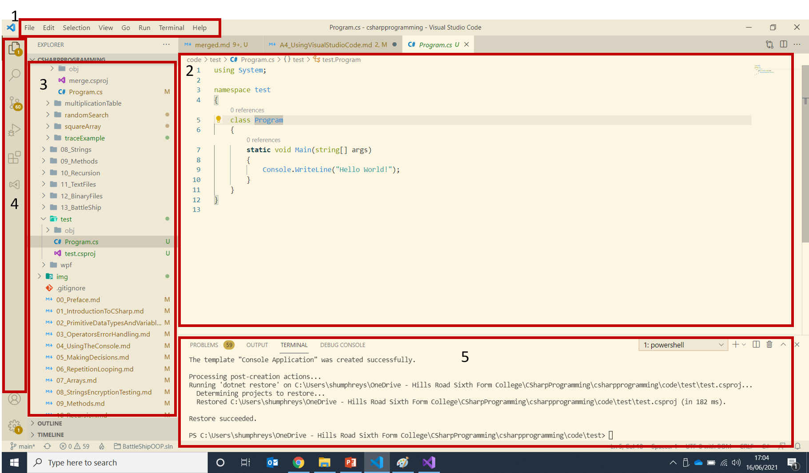
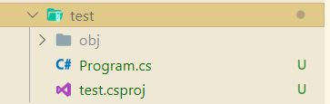

# Appendix 4: Using Visual Studio Code and Visual Studio Community

Visual Studio Code (VSCode) is a lightweight alternative to Visual Studio.  It is first and foremost a source code editor rather than an IDE but is available for Windows. Mac and Linux making it an ideal solution for those without access to a Windows machine.  It's also a brilliant text editor - this text was written entirely using VS Code.  It also runs as a portable application so you can carry the editor with on a USB device.  

VSCode will not build and run C\# code out of the box, it requires an extension to be added.  There are dozens (hundreds?) of different extensions available for VSCode for multiple langauges that makes it almost a one-stop shop for development.  It's a great tool for C\# development, and Python.  It's an excellent HTML editor and great for Javascript too.

In addition, your system will need to have the .NET Core SDK installed.

## Install .NET

Go to [Microsoft Downloads](https://dotnet.microsoft.com/download) and select the latest recommended version of .NET for your target machine, the SDK not the run-time.  At time of writing this was .NET 5.0.  Then install it as you would other software for your computer.

## Install Visual Studio Code

Visual Studio Code is available from [Microsoft](https://code.visualstudio.com/Download) and download the version for your target machine.  Install as usual.

If you want to make it portable, add a directory named `data` into the installation directory.

## Install the C\# Extension

Run Visual Studio Code and select the Extensions icon from the toolbar on the left hand side.  Search for C# and select "C# for Visual Studio Code (powered by Omnisharp) from the list of extensions displayed.  Select install.

That's it!  Now you're ready to code in C\# using Visual Studio Code

## The VSCode GUI

<figure markdown="span">
  { width="600" }
  <figcaption>VSCode interface</figcaption>
</figure>

There are 5 main parts to the interface:

1. Menu
2. Code Editor
3. File Explorer
4. Sidebar
5. Terminal 

Each of these should hold no surprises, the sidebar is particularly useful.  Spend some time getting familiar with teh various elements of the GUI, the options in the menu system, working with the terminal and opening/closing files and directories.

## Creating a console application

Creating new projects, build those projects and running them is done via a terminal window using commands.  Open a new terminal using the Terminal menu and navigate to the directory where you want to save your project files.  To create a new directory use: 
`mkdir \<nameOfDirectory\>`. Then change into that directory using `cd \<nameOfDirectory\>`

Enter the following command:

`dotnet new console`

This instructs VSCode to create a new project using the `console` template, i.e. a new console application.  Other templates are available.

<figure markdown="span">
  { width="500" }
  <figcaption>New Console project with VSCode</figcaption>
</figure>

Click the `Program.cs` file and this will be loaded into the editor.  Write your code and save.  To build and run the code enter the command:

`dotnet run`

The code will be compiled, and if no errors found will be run in the terminal window.

## Using a Class Library

The __class library__ includes any classes used by another application.  The .NET target needs to be the same as the .NET target of the other application but in theory the class library can be distributed as a third-party component.  Or, as here, to encourage __code separation__.

1. Create a solution

    ```bash
    dotnet new sln
    ```

2. Create a class library project

    ```bash
    dotnet new classlib -o libraryName  // -o specifies the location of the generated output
    ```

3. Add the class library to the project

    ```bash
    dotnet sln add libraryName/libraryName.csproj
    ```

4. Make changes/create the class library code

5. Check it builds without error

    ```bash
    dotnet build
    ```

6. Create the console application skeleton

    ```bash
    dotnet new console -o <ConsoleUI>   // ConsoleUI = name of the console application
    ```

7. Add the console application to the solution

    ```bash
    dotnet sln add ConsoleUI/ConsoleUI.csproj
    ```

8. Code the Console application

9. Add a project reference so the console app has access to the class library

    ```bash
    dotnet add ConsoleUI/ConsoleUI.csproj reference LibraryDir/LibraryName.csproj
    ```

10. Run the application

    ```bash
    dotnet run --project ConsoleUI/ConsoleUI.csproj
    ```