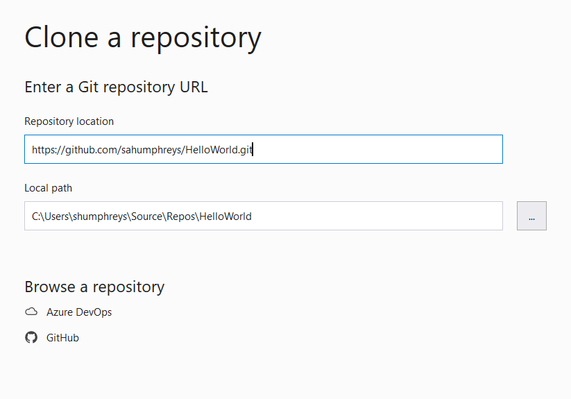

# {{ title}}

__Git__ is a version control system used to track changes in files, manage project versions, and facilitate collaboration on software projects. It operates locally, meaning all files and their histories are stored on your computer. Git helps you keep track of code changes and makes it easy to revert to previous versions if necessary.

__GitHub__ is an online service that hosts Git repositories, allowing you to store your project files online, collaborate with others, and access your files from anywhere. It also provides tools for code review, project management, and documentation.

Project files can be managed via the command-line, through a GUI or direct via the IDE (Visual Studio or Visual Studio Code) or even the GitHub site.  For now we'll use the latter to understand how Git works and learn some important vocabulary and functionality.  There are many online sites explaining how to use Git from the command-line for your given operating system. 

## Create a GitHub account

Before starting with GitHub, you'll need to set up a free account. Visit [github.com](https://github.com/) and follow the sign-up process. Once you've verified your email address, you'll be able to create repositories and start using GitHub.

## Git repositories

A __repository__ (or __repo__) is a storage space for your project files and their history. It can include any type of file, but it's a good practice to include a __README__ file, usually written in __markdown__, to provide information about your project.

To create a new repository on GitHub:

1. Click on the "New" button on your GitHub dashboard.
2. Give your repository a meaningful name, set the access to __Public__ or __Private__, and check the box to include a README file.
3. Click "Create repository."

I've called mine:  "MyGitHubTest":

<figure markdown="span">
  { width="500" }
  <figcaption>GitHub New Repository</figcaption>
</figure>

## Making Changes with Commits

When you make changes to your files, you need to __commit__ those changes to the repository. A commit is a snapshot of your project's current state, along with a message describing what has been changed.

1. Add a new file to your repository using the GitHub web interface. For example, create a simple "Hello World" C# source file.
2. In the __Commit__ section below the text editor, write a brief message summarizing the changes, such as "Created Hello World file".
3. Click "Commit New File."

You should commit changes often and write clear messages that explain why the change was made.

## Working with Branches

Branches allow you to work on different versions of your project at the same time. By default, a new repository has one branch named `main`.

Think of the branch as a work in progress, a possible revision to the original code.  Changes can be made to `main` directly, or to a branch.

1. To create a new branch, click the branch dropdown on the top left of the repository page and select "New branch."
2. Name your branch (e.g., "feature-update") and click "Create branch."

<figure markdown="span">
  { width="500" }
  <figcaption>Creating a branch</figcaption>
</figure>

A name for the branch needs to added, then click "Create branch ...".

There are now two branches, `main` and the one just created.

We'll use this branch to make changes to the README file.  Select this file and click the pencil icon to move into edit mode.  Make changes to the README and then __commit__ the file with a suitable commit message.

Now we have our repository with a branch that is different to `main`.

## Pull Requests

A __pull request__ lets you propose changes to a repository and discuss them with collaborators before merging. 

1. Click the __Pull Requests__ tab and select "New Pull Request."
2. Choose the branch you want to merge into `main` and review the changes.
3. If everything looks good, click "Create pull request."

Give your pull request a meaningful title and description, then click "Create pull request" again.

<figure markdown="span">
  { width="500" }
  <figcaption>Pull Request</figcaption>
</figure>

The final stage is to "Merge Pull Request" into ```main``` which is the next window to be displayed.  Once clicked the final stage is to delete the branch from the next window.

<figure markdown="span">
  { width="500" }
  <figcaption>Delete branch</figcaption>
</figure>

## Using the command line 

It is frequently easier to control your Git repository using the command line.  It's helpful to know how to use the various commands in this way to help understanding what is happening behind the scenes with a graphical tool.

For MacOS and Linux a terminal window is all you need, for Windows there is a Unix emulator, GitBash.  For both you will need some familiarity with general Unix (Linux) commands available for the terminal and there are plenty of online sites that provide such an introduction.

You'll need to download and install Git for your target operating system and it's useful to have a GitHub account for saving a copy online.  On a local installation we need to set our username and email address:

```bash
git config --global user.name "Enter your name here"
git config --global user.email "Enter you email address here"
```

To create a repository use the following sequence of commands:

```bash
cd <project_directory>
git init                                # creates the local repository in directory
git add .                               # tells Git to track ALL files
git status                              # display current status of repository
git commit -m "<Enter commit message>"  # Save current version of tracked files
git remote add origin <URL of remote>   # connect the local and remote repositories
git remote -v                           # verifies the URL
git push origin main                    # uploads files to remote repository
```

When you're the only person working on your project, and on a single computer, it is fair to assume your local repository is the most up to date version but using Git can still be useful to track changes and if necessary revert to a previous version.

If working in a team, or on a different computer and have the project backed up on GitHub, issue the command `git pull` to get the latest version.

Get into the habit of committing and pushing changes to your project often, even small changes.

## Using GitHb with Visual Studio

Visual Studio integrates Git functionality, making it easy to manage repositories, branches, and commits directly from the IDE.


### Clone an existing repository

1. From the Visual Studio start window, select "Clone a Repository."
2. Enter the URL of the GitHub repository and choose a local path to save it.
3. Click "Clone."

<figure markdown="span">
  { width="500" }
  <figcaption>Clone an existing repository</figcaption>
</figure>

### Committing Changes in Visual Studio

1. Make changes to your project files.
2. Open the __Git Changes__ window (View -> Git Changes).
3. Write a commit message and click "Commit All."

### Pushing Changes

To push changes to GitHub:

1. In the __Git Changes__ window, click "Push."
2. This will upload your commits to the GitHub repository.

## Summary

Git and GitHub provide powerful tools for managing code and collaborating on projects. By understanding the basics of creating repositories, making commits, using branches, and creating pull requests, you can effectively manage your projects and work with others.

For more in-depth learning, consider exploring the official [Git documentation](https://git-scm.com/doc) and [GitHub guides](https://guides.github.com/).


